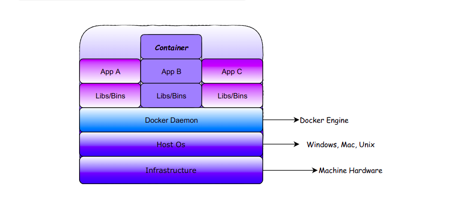
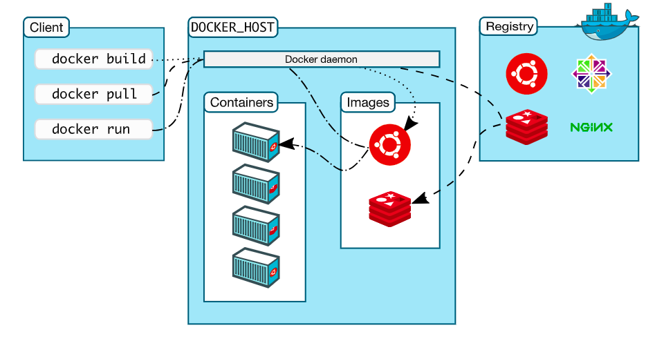

## What is Docker ?
Docker is a platform that allows developers to automate the deployment, scaling, and management of applications using containerization.



## Docker ecosystem 
**Docker Registry**: Docker maintains all the images in the registry and they can
be pulled from the registry too
**Docker Hub**: This is the repository for all your custom-built images. Images
can be pushed and accessed from the Hub
**Docker Client**: The CLI tool used to interact with the Docker server
**Docker Daemon**: The Docker server process responsible for pulling, pushing,
and building the images. It is also used for running the container


## Communication between a Docker client and the Docker daemon
A container is an instance of an image. Whenever we need to run a particular
image, we need to have that image on the system. Using the Docker client, you can
ask the Docker daemon to run a particular image. The daemon will go ahead and
look for the image on a system. If it finds the image, it will run the container
forked from that image. However, if the image is not present on the system, it will
pull the image from the Docker registry and create a container from the image.




### Container Management CLIs


#### This command creates a container but does not start it.
```yaml
docker create --name <container_name> <image_name>
docker create --name my_container alpine
```

#### This command creates and starts a container in one step.
```yaml
docker run --name <conainer_name> -d <image_name>
docker run --name my_running_container -d alpine
```

-d means detach mode

#### This command starts a previously created container.
```yaml
docker start <container_name>
docker start my_container
```

#### This command stops a running container immediately by sending a SIGKILL signal.
```yaml
docker kill <container_name>
docker kill my_running_container
```

#### This command restarts a running container.
```yaml
docker restart <container_name>
docker restart my_running_container
```

#### This command pauses all processes within a container.
```yaml
docker pause <container_name>
docker pause my_running_container
```

#### This command unpauses all processes within a container.
```yaml
docker unpause <container_name>
docker unpause my_running_container
```

#### This command removes a container forcefully, stopping it if necessary.
```yaml
docker rm -f <containe_name>
docker rm -f my_container
-f is optional 
```


### Inspecting The Container

#### Lists running containers.
```yaml
docker ps 
-a, --all: Show all containers (default shows just running).
-q, --quiet: Only display container IDs.
--filter: Filter output based on conditions provided (e.g., status).
docker ps -a --filter "status=exited"
```


#### Fetch the logs of a container.
```yaml
docker logs -f my_running_container --tail 10
-f, --follow: Follow log output.
--since: Show logs since a specific time.
--tail: Number of lines to show from the end of the logs.
```

#### Display the running processes of a container.
```yaml
docker top my_running_container
```

#### Inspect changes to files or directories on a container's filesystem.
```yaml
docker diff my_running_container
```

#### Return low-level information on Docker objects.
```yaml
docker inspect --format='{{.State.Running}}' my_running_container
-f, --format: Format the output using a Go template.
-s, --size: Display total file sizes if the type is a container.
```


## Interacting with Container


#### Attach local standard input, output, and error streams to a running container.
```yaml
docker attach my_running_container
```


#### Copy files/folders between a container and the local filesystem.
```yaml
docker cp my_container:/path/in/container /path/on/host
docker cp /path/on/host my_container:/path/in/container
```


#### Export a container’s filesystem as a tar archive.
```yaml
docker export -o my_container.tar my_container
```


#### Run a command in a running container.
```yaml
docker exec -it my_running_container /bin/sh
```


## Image Management Commands


#### List images.
```yaml
docker images -a
-a, --all: Show all images (default hides intermediate images).
-q, --quiet: Only show numeric IDs.
```

#### Show the history of an image.
```yaml
docker history [OPTIONS] IMAGE
docker history alpine
-H, --human: Print sizes and dates in human-readable format (default true).
-q, --quiet: Only show numeric IDs.
--no-trunc: Don’t truncate output.
```


#### Create a tag TARGET_IMAGE that refers to SOURCE_IMAGE.
```yaml
docker tag SOURCE_IMAGE[:TAG] TARGET_IMAGE[:TAG]
docker tag my_image:latest my_image:v1.0
```


#### Create a new image from a container’s changes.
```yaml
docker commit -m "Added new feature" my_container my_image:new_feature
-a, --author: Author (e.g., "John Doe john.doe@example.com").
-m, --message: Commit message.
-p, --pause: Pause container during commit (default true).
```


#### Remove one or more images.
```yaml
docker rmi [OPTIONS] IMAGE [IMAGE...]
docker rmi -f alpine
-f, --force: Force removal of the image.
--no-prune: Do not delete untagged parents.
```


## Image Transfer Commands
#### Pull an image or a repository from a registry.
```yaml
docker pull alpine:latest
```

#### Push an image or a repository to a registry.
```yaml
docker push my_image:latest
```

#### Search the Docker Hub for images.
```yaml
docker search alpine
```

#### Log in to a Docker registry.
```yaml
docker login -u myusername -p mypassword
```

#### Log out from a Docker registry.
```yaml
docker logout
```

#### Save one or more images to a tar archive (streamed to STDOUT by default).
```yaml
docker save -o my_image.tar my_image:latest
-o, --output: Write to a file, instead of STDOUT.

```

#### Load an image from a tar archive or STDIN.
```yaml
docker load -i my_image.tar
-i, --input: Read from a tar archive file, instead of STDIN.
```


