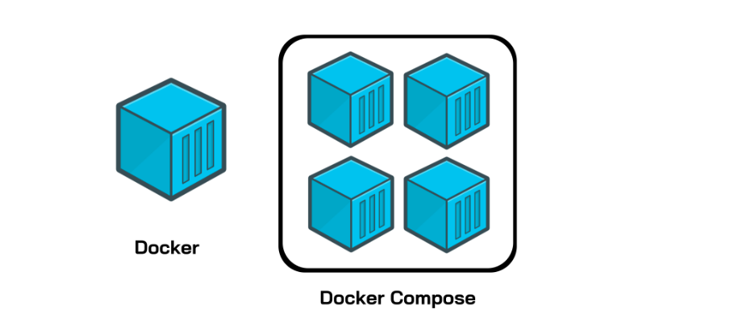

## Docker Compose
Docker Compose is a Docker tool used to define and run multi-container applications. With Compose, you use a YAML file to configure your application’s services and create all the app’s services from that configuration.    

The docker-compose.yaml file is used to define and run multi-container Docker applications. It includes various commands and key-value pairs to configure services, networks, and volumes. Here's a comprehensive guide to the commands and key-value pairs used in a docker-compose.yaml file, along with explanations for each:    

Think of docker-compose as an automated multi-container workflow. Compose is an excellent tool for development, testing, CI workflows, and staging environments. According to the Docker documentation, the most popular features of Docker Compose are:    

Multiple isolated environments on a single host    
Preserve volume data when containers are created    
Only recreate containers that have changed    
Variables and moving a composition between environments    
Orchestrate multiple containers that work together    


```yaml

version: '3'
services:
  web:
    # Path to dockerfile.
    # '.' represents the current directory in which
    # docker-compose.yml is present.
    build: .

    # Mapping of container port to host
    
    ports:
      - "5000:5000"
    # Mount volume 
    volumes:
      - "/usercode/:/code"

    # Link database container to app container 
    # for reachability.
    links:
      - "database:backenddb"
    
  database:

    # image to fetch from docker hub
    image: mysql/mysql-server:5.7

    # Environment variables for startup script
    # container will use these variables
    # to start the container with these define variables. 
    environment:
      - "MYSQL_ROOT_PASSWORD=root"
      - "MYSQL_USER=testuser"
      - "MYSQL_PASSWORD=admin123"
      - "MYSQL_DATABASE=backend"
    # Mount init.sql file to automatically run 
    # and create tables for us.
    # everything in docker-entrypoint-initdb.d folder
    # is executed as soon as container is up nd running.
    volumes:
      - "/usercode/db/init.sql:/docker-entrypoint-initdb.d/init.sql"
```


**version ‘3’**: This denotes that we are using version 3 of Docker Compose, and Docker will provide the appropriate features. At the time of writing this article, version 3.7 is latest version of Compose.     

**services**: This section defines all the different containers we will create. In our example, we have two services, web and database.    

**web**: This is the name of our Flask app service. Docker Compose will create containers with the name we provide.    

**build**: This specifies the location of our Dockerfile, and . represents the directory where the docker-compose.yml file is located.    

**ports**: This is used to map the container’s ports to the host machine.    

**volumes**: This is just like the -v option for mounting disks in Docker. In this example, we attach our code files directory to the containers’ ./code directory. This way, we won’t have to rebuild the images if changes are made.    

**links**: This will link one service to another. For the bridge network, we must specify which container should be accessible to which container using links.    

**image**: If we don’t have a Dockerfile and want to run a service using a pre-built image, we specify the image location using the image clause. Compose will fork a container from that image.    

**environment**: The clause allows us to set up an environment variable in the container. This is the same as the -e argument in Docker when running a container.    


#### Builds, (re)creates, starts, and attaches to containers for a service.
```yaml
docker-compose up
docker-compose up -d
docker-compose up --build
-d: Run containers in detached mode.
--build: Build images before starting containers.
```

#### Stops and removes containers, networks, volumes, and images created by docker-compose up.
```yaml
docker-compose down
docker-compose down --volumes
docker-compose down --rmi all
--volumes: Remove named volumes declared in the volumes section of the Compose file.
--rmi all: Remove all images used by any service.
```


#### Builds or rebuilds services.
```yaml
docker-compose build
docker-compose build --no-cache
--no-cache: Build without using cache.
```


#### Stops running containers without removing them.
```yaml
docker-compose stop
```

#### Restarts containers.
```yaml
docker-compose restart
```

#### Removes stopped service containers.
```yaml
docker-compose rm
docker-compose rm -f
```

#### Validates and views the Compose file.
```yaml
docker-compose config
docker-compose config --services
--services: List all services.

```


***docker-compose is the traditional tool for managing multi-container Docker applications installed separately.***

***docker compose is the modern, integrated approach that comes with Docker CLI, offering a more streamlined experience.***

