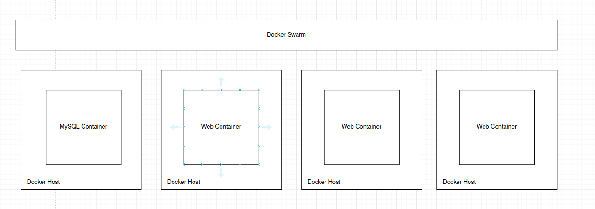
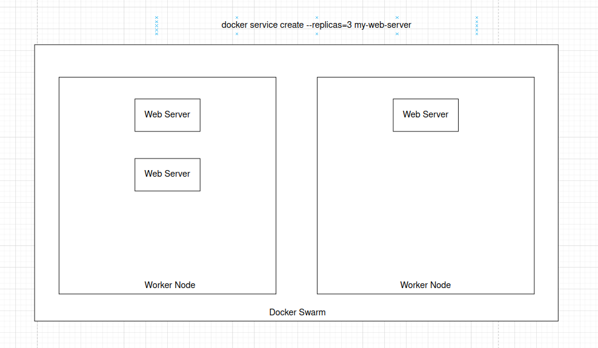

## Docker Swarm

In general this is how we used docker until now     


1. The above approach is only good for local testing.
2. We can't use this approach in production because it introduces a single point of failure.
3. This is where Docker Swarm comes into play:
4. Docker Swarm allows you to combine multiple Docker machines (different computers) into a single cluster.
5. It takes care of distributing your services across separate hosts for high availability.
6. Docker Swarm helps with load balancing across different systems.
```
In simple terms:
    Multiple computers with Docker installed are connected to each other to run containers.
```
This is how docker swarm looks at high level   



#### Setup Swarm

You must have different machines with Docker installed on them (you can use Docker Machine locally to achieve the same).

Make one of the machines (host) the Swarm manager and others as workers (slaves).

To make a host the manager, run ```docker swarm init```. This command will provide a command that should be run on worker nodes to make them worker nodes.

#### Terminologies
1. Host: Refers to the Docker instance on the main computer.
2. Workers: Refers to the Docker instances on other computers.
3. When we say Docker host, you can think of a Docker terminal inside a computer.


#### Swarm Manager

1. Swarm Manager:
    1. Responsible for maintaining cluster state and managing workers.
    2. Adds and removes workers, creates, distributes, and ensures the state of containers and services across all worker nodes.

2. Single Manager Node:
    1. Having a single manager node is not recommended because it introduces a single point of failure.

3. Fault Tolerance:
    1. Use multiple manager nodes in a single cluster for fault tolerance.
    2. Only a single manager node is allowed to make decisions using leader election.

4. Leader Election:
    1. For every operation, the leader informs other managers and then makes a decision.
    2. If the leader goes down, a new leader should have all the info about the cluster to start managing (this is known as the distributed consensus problem).
    3. Docker uses RAFT to solve the distributed consensus problem.

    

5. RAFT Protocol:
    1. Every swarm manager has a database for storing cluster info.
    2. At intervals, each manager pings other managers to check aliveness and for new info using RAFT, keeping them in sync.

6. Quorum:
    1. Every decision should be agreed upon by the majority of manager nodes.
    2. Quorum means the minimum number of members in an assembly that must be present to make the proceedings valid.
    3. Formula: Quorum of N = N/2 + 1
    4. Example: Quorum of 5 = 5/2 + 1, which equals 3 (rounded up using math.ceil).


#### Extra(optional)

##### Container Orchestration
```
    Definition: Container orchestration is the automated process of managing and scheduling the deployment, networking, scaling, and operation of containerized applications.
    Purpose: It helps manage the lifecycle of containers, ensuring that applications are available, scalable, and resilient.
    Tools: Popular container orchestration tools include Docker Swarm, Kubernetes, and Apache Mesos.
```
##### Cluster
```
    Definition: A cluster is a group of interconnected computers (nodes) that work together as a single system to provide high availability, scalability, and reliability.
    Components: In a container orchestration context, a cluster typically consists of multiple nodes, including:
    Manager Nodes: Responsible for maintaining the cluster state and orchestrating tasks.
    Worker Nodes: Execute the tasks assigned by the manager nodes.
    Benefits: Clusters ensure that applications can handle increased loads and recover from failures.
```
##### Fault Tolerance
```
    Definition: Fault tolerance is the ability of a system to continue operating properly in the event of a failure of some of its components.
    Importance: It ensures that the system remains available and functional despite hardware or software failures.
    Methods: Fault tolerance can be achieved through redundancy, where multiple instances of critical components are run, and through automatic 
    failover mechanisms that switch to backup systems when a failure is detected.
    In Container Orchestration: In tools like Docker Swarm and Kubernetes, fault tolerance is achieved by:
        Distributing tasks across multiple nodes.
        Automatically rescheduling tasks on healthy nodes if a node fails.
        Using leader election and consensus algorithms (like RAFT) to manage state and decision-making across multiple manager nodes.
```


**Docker recommends 7 managers**, but there is no limit on the number of managers you can have.    

**Fault tolerance formula**: N = N/2 - 1    

**Odd number of managers**: Docker recommends selecting an odd number of managers because it ensures smooth leader elections.   

**Example scenario:**    
    If you have 3 managers and 5 worker nodes, and 2 managers go down, you can still access your containers because the worker nodes are running.    
    However, you can't create new containers, modify existing containers, or perform tasks that require a manager.       
**Recovering failed manager nodes:**     
    If you can't recover failed manager nodes, you can't recover the cluster.
    To re-create the cluster, use the command: ```docker swarm init --force-new-cluster.```    
    After running this command, you will have 1 manager node, 5 worker nodes, and a running cluster.     
    You can run all manager-related actions on this single manager node.    


**Promoting a worker node to a manager:**     
    Use the command: docker node promote on the worker node.

**Manager nodes as worker nodes:**    
    By default, all manager nodes are also worker nodes, meaning all services run on them as well.       
    This is not recommended by Docker; managers should only manage.    
    To disable this, use the command: ```docker node update --availability drain <node>.```       

**In production:**    
Manager nodes should only be used for managing tasks, not running services.    


#### Docker swarm demo

**init docker swarm**

```yaml
# Initialize a Docker Swarm cluster
# You need to specify the IP address of the Docker host
docker swarm init --advertise-addr <IP_ADDRESS>

# Get the command to run on worker nodes to join the cluster
docker swarm init --advertise-addr <IP_ADDRESS>

# List running nodes in the cluster
docker node ls

# Run this on worker nodes to join the cluster
docker swarm join --token <TOKEN> <MANAGER_IP>:2377

# Run this on a worker node to leave the cluster
docker swarm leave

# From a manager node, remove a worker node from the cluster
docker node rm <NODE_NAME>

# To add a new manager node
# Run this on an existing manager node to get the command
docker swarm join-token manager

# To promote a worker to a manager
# Run this on an existing manager node
docker node promote <NODE_NAME>

# To shutdown a node (manager or worker)
shutdown now

# List running nodes in the cluster again to check status
docker node ls

```


#### Docker Service
**Purpose**: Docker Swarm provides orchestration and load balancing for you.

**Running Containers Across Multiple Worker Nodes:**      
To run your image as containers in Docker Swarm across multiple worker nodes, use the command on a manager node:      
```yaml    
    docker service create --replicas=3 <image_name>
```
--replicas: Specifies the number of container instances you want to run.    


**Specifying Ports and Networks:**          
To create a service with port mapping and network configuration:        
```yaml
docker service create --replicas=3 -p 8080:80 --network frontend <image_name>
```    
-p 8080:80: Maps port 8080 on the host to port 80 in the container.    
--network frontend: Connects the service to the specified network.     


**Service Creation and Task Scheduling:**

1. When you run the ```docker service create``` command to create multiple instances of your image:
    1. The orchestrator on the manager node decides how many tasks to create.     
    1. The scheduler then assigns these tasks to worker nodes.       
     
**Each task represents a container and is responsible for:**
Starting the actual container.
Updating the status of the container to the manager node.
If a container goes down, the manager node will re-create and restart the container by creating a new task.


Here’s how Docker Swarm handles the scenario with 2 worker nodes and --replicas=3:




Here’s how Docker Swarm handles the scenario with 4 worker nodes and --replicas=3:


If one of the worker nodes fails, Docker Swarm will redeploy a new instance of the container on the available worker nodes, such as Worker Node 4, until the failed node is restored or replaced. During this time, the failed node's tasks will be redistributed, and the remaining worker nodes will ensure the service maintains the desired number of replicas.


#### Types of Services


**Replicas**

Purpose: To run a specified number of container instances across available worker nodes.    
Creation: Use the --replicas argument.    
Example:
```yaml
docker service create --replicas=3 my-web-server
```

**Global**

Purpose: To ensure that a container is running on every worker node in the cluster.   
Creation: Use the --mode global argument.    
Example:
```yaml
docker service create --mode global my-monitoring-agent
```
Explanation: This command creates a global service with the my-monitoring-agent image, ensuring that a container instance is running on every worker node, including any idle nodes.   


#### Service Naming

Default Naming: If you don’t provide a name, Docker assigns a random name to the service.
Custom Naming: To specify a name for the service, use the --name option:
```yaml
docker service create --replicas=3 --name web-server <my-web-server>
```
Instance Naming: Docker Swarm will automatically append a number to the service name for each instance. For example, instances of the web-server service might be named web-server.1, web-server.2, etc.


#### Service Update
Update Replicas: To change the number of replicas for an existing service:
```yaml
docker service update --replicas=4 <web-server>
```
#### Manager Node Commands:

Help: Get help on Docker service commands:
```yaml
docker service --help
```
List Services: List all services in the swarm:
```yaml
docker service ls
```
Service Tasks: View tasks for a specific service:
```yaml
docker service ps <service_name>
```

Check Logs: To check the logs of the container instances, go to the worker node and use docker logs <container_id>.

Publish Ports After Service Start: To publish a new port for an existing service:

```yaml
docker service update <service_name> --publish-add 5000:80
```


#### Advanced Networking


1. **Default Networks in Docker**:
    1. Docker provides some default networks that are available right after installation. You don't have to create them manually.     


2. **Bridge Network**:
    1. Purpose: Default network for containers.
    2. Behavior: Every container you create is attached to this network by default unless specified otherwise.
    3. Network Type: Private internal network created by Docker on the Docker host.
    4. IP Addressing: Containers attached to the bridge network receive internal IP addresses, usually in the 172.17.x.x range.
    5. Internal Communication: Containers can communicate with each other using these internal IP addresses or container names (which resolve to IP addresses).
    6. External Access: To access containers from outside the Docker host, you need to set up port mapping     

3. **Host Network**:

    1. Purpose: Removes network isolation between the host and the Docker container.
    2. Behavior: A container attached to the host network will use the host's network stack. For example, if a web server runs on port 5000 in a container, it is automatically accessible on port 5000 of the host without needing port mapping.
    3. Port Conflicts: Ensure that the host machine does not use the same port to avoid conflicts.     

4. **None Network:**
    1. Purpose: No network connectivity.
    2. Behavior: Containers are not attached to any network and have no access to the external environment or other networks.          


Containers on different Docker hosts cannot communicate with each other directly unless you set up complex port mapping and routing, which can be impractical.          


#### Overlay Network:

**Purpose**: Allows containers across different Docker hosts in a swarm cluster to communicate with each other.

**Behavior**: Creates an internal private network that spans all nodes participating in the Docker Swarm cluster.
```yaml
docker network create --driver overlay --subnet 10.0.9.0/24 my-overlay-network
```
--driver overlay: Specifies that the network should use the overlay driver, which supports multi-host networking.     
--subnet 10.0.9.0/24: Defines the IP address range for the overlay network. Containers on this network will receive IPs in this range.     
my-overlay-network: Name of the new network being created.    

```yaml
docker service create --replicas=2 --network my-overlay-network nginx
```

**Advantages**: This setup allows containers across different hosts to communicate seamlessly through the overlay network.     

    


#### Ingress Network


**Port Mapping in Docker:**

For a single container, you can use port mapping to make the container accessible from the outside world:
```yaml
docker run -p 80:5000 <my-web-service>
```      
     
-p 80:5000: Maps port 5000 inside the container to port 80 on the Docker host, making the container accessible via port 80 on the host.        


#### Ingress Network in Docker Swarm:

**Automatic Creation**: When you create a Docker Swarm, an ingress network is automatically created.     
    
**Purpose**: The ingress network provides built-in load balancing and routes traffic from published ports to the correct ports on containers.        
**Load Balancing**: Redirects traffic from a published port (e.g., port 80) to the appropriate mapped port (e.g., port 5000) on each container.       
**Configuration**: No additional configuration is required to create the ingress network; it is created automatically with the swarm.         


#### Ingress Network Details:    

**Accessing Containers:**       
You can access containers using the IPs of Docker hosts (worker nodes). Even if a container is not running on a particular worker node, you can still access the service through the ingress network, which routes traffic to the available containers.          
**Container-to-Container Communication:**     
Within the swarm cluster, you can access containers by their container name. Docker handles the resolution of container names to the correct IP addresses.      


#### Docker Stacks


docker-compose.yaml: A general Docker Compose file to deploy multiple containers.   

```yaml
version: 3
services: 
    web: 
        image: 'my-web-server'
    database:
        image: 'mongodb'
```

**Container**
A lightweight, standalone, and executable package that includes everything needed to run a piece of software, including the code, runtime, system tools, libraries, and settings.    


**Service:** 
One or more instances of the same type of container running on a single node or across multiple nodes in a swarm cluster.    


**Stack:** 
A group of interrelated services that together form an entire application.   


Docker Stack YAML
docker-stack.yaml: A Docker Compose file used to deploy a stack in Docker Swarm.

```yaml
version: 3
services: 
    web: 
        image: 'my-web-server'
    database:
        image: 'mongodb'
        deploy:
            replicas: 1  # Number of replicas you want
            placement: 
                constraints:
                    - node.hostname == node1  # Deploy on node with hostname 'node1'
                    - node.role == manager    # Run on a manager node with the name 'node1'
            resources:
                limits:
                    cpus: "0.01"
                    memory: "50M"  # Resource limits for a single instance of the container
```

Deploy Stack:
From the manager node:   

```yaml
docker stack deploy --compose-file docker-stack.yaml <stack_name>
```
Update Stack:
Update your docker-stack.yaml file and run the same command to apply changes:    
```yaml
docker stack deploy --compose-file docker-stack.yaml <stack_name>

```
#### Stack Commands
```yaml
# List all running stacks
docker stack ls

# View detailed information about the 'my_stack' stack
docker stack inspect my_stack

# List all services running in the 'my_stack' stack
docker stack services my_stack

# List all tasks (containers) in the 'my_stack' stack
docker stack ps my_stack

# Remove the 'my_stack' stack and all its associated services
docker stack rm my_stack
```


### Step-by-Step Setup Demo 

####  Docker Swarm cluster with 3 manager nodes and 3 worker nodes on your local machine

#### 1. Install Docker and Docker Machine in your local


### 2. Create Docker Machines

+ **Create Docker Machines**
Create 3 manager nodes and 3 worker nodes using docker-machine:

```sh
# Create manager nodes
docker-machine create --driver virtualbox manager1
docker-machine create --driver virtualbox manager2
docker-machine create --driver virtualbox manager3

# Create worker nodes
docker-machine create --driver virtualbox worker1
docker-machine create --driver virtualbox worker2
docker-machine create --driver virtualbox worker3
```
+ **Initialize the Swarm on Manager1**
```sh
# Switch to manager1
eval $(docker-machine env manager1)

# Initialize Docker Swarm
docker swarm init --advertise-addr $(docker-machine ip manager1)
```
+ **Join Other Managers to the Swarm**     
Get the join token for manager nodes:

```sh
docker swarm join-token manager
```

Copy the provided join command and run it on manager2 and manager3:     

```sh
# Switch to manager2
eval $(docker-machine env manager2)
docker swarm join --token <manager_join_token> $(docker-machine ip manager1):2377

# Switch to manager3
eval $(docker-machine env manager3)
docker swarm join --token <manager_join_token> $(docker-machine ip manager1):2377

```
+ **Join Workers to the Swarm**     
Get the join token for worker nodes:     

```sh
docker swarm join-token worker
```
Copy the provided join command and run it on worker1, worker2, and worker3:      

```sh
# Switch to worker1
eval $(docker-machine env worker1)
docker swarm join --token <worker_join_token> $(docker-machine ip manager1):2377

# Switch to worker2
eval $(docker-machine env worker2)
docker swarm join --token <worker_join_token> $(docker-machine ip manager1):2377

# Switch to worker3
eval $(docker-machine env worker3)
docker swarm join --token <worker_join_token> $(docker-machine ip manager1):2377

```

+ **Verify the Swarm Setup**

```sh
# Switch back to manager1
eval $(docker-machine env manager1)

# List nodes to verify setup
docker node ls
```

#### 4 Deploy Your Application with Docker Stack

+ Create a docker-stack.yml file:

```yaml
version: "3.8"

services:
  frontend:
    image: my-react-app:latest
    deploy:
      replicas: 3
      placement:
        constraints:
          - node.role == worker
      resources:
        limits:
          cpus: "0.5"
          memory: "512M"
    networks:
      - my-network
    ports:
      - "3000:3000"

  backend:
    image: my-nodejs-backend:latest
    deploy:
      replicas: 3
      placement:
        constraints:
          - node.role == worker
      resources:
        limits:
          cpus: "0.5"
          memory: "512M"
    networks:
      - my-network
    ports:
      - "5000:5000"

networks:
  my-network:
    driver: overlay
```

+ Deploy the stack:

```sh
# From manager1
eval $(docker-machine env manager1)

docker stack deploy --compose-file docker-stack.yml my_app
```

+ Verify Deployment

```sh
# Check services
docker stack services my_app

# Check tasks (containers) for each service
docker stack ps my_app
```