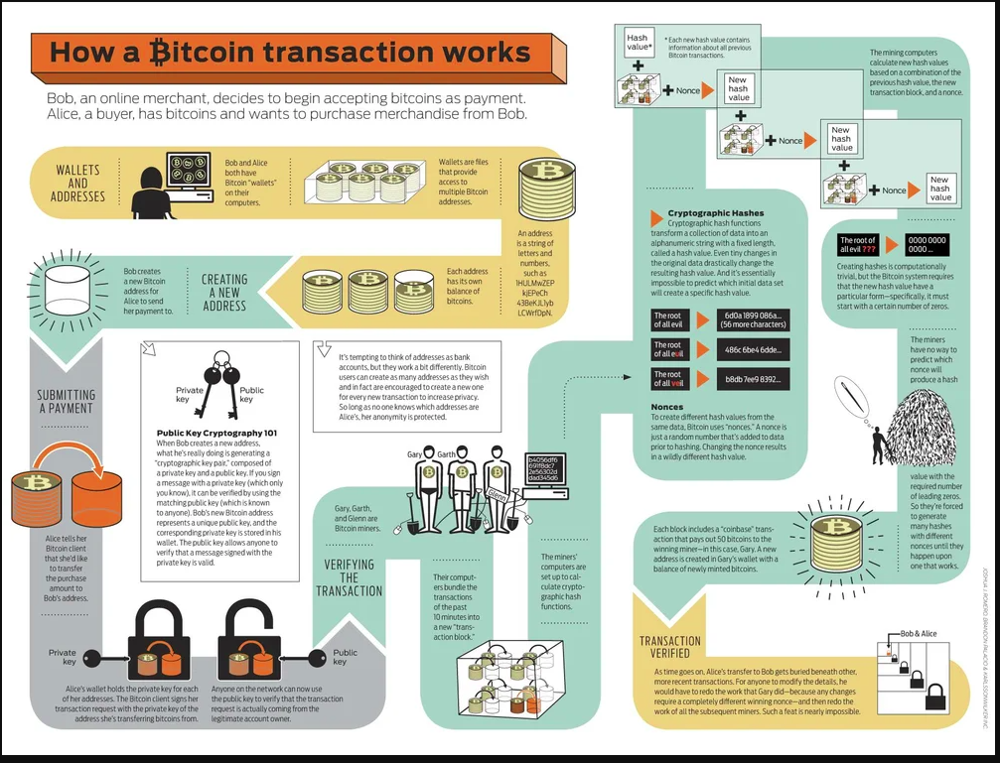
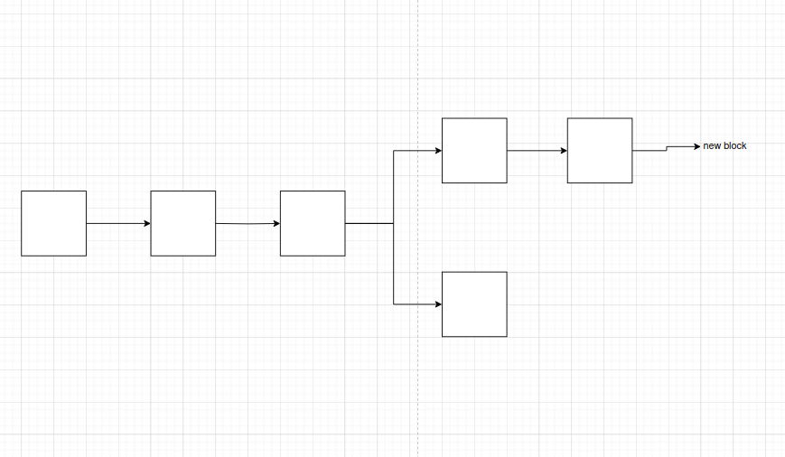

# Introduction to Blockchain and Web3

## Web 1.0
- The era of Web 1.0 was from roughly 1991 to 2004.
- Web pages were mostly static, with little dynamic content.
- Web 1.0 is referred to as the read-only web.
- Running advertisements was banned in Web 1.0.
- Primarily used for information and research.
- Frames and tables were used to position and align elements.

## Web 2.0
- Web 2.0 refers to worldwide websites that highlight user-generated content.
- Focuses on interactions, social media, communities, and GUIs.
- Large emphasis on UI/UX design.
- Brought the popularity of AJAX and JavaScript for dynamic websites and animations.
- User data is owned and controlled by central authorities or entities (e.g., Google, Facebook, Amazon).
- Web 2.0 is what you most interact with today.

## Web 3.0
- Web 3.0 is closely associated with cryptocurrency and blockchain networks.
- There is a significant focus on backend systems, databases, and ledgers.
- Data is not owned by a single party but is shared across the network.
- Web 3.0 is meant to be portable and personal.
- Web 3.0 emphasizes immersion over interaction (e.g., the metaverse aims for full immersion rather than just interaction with the internet).
- Key tools used in Web 3.0 include blockchain, decentralization, and artificial intelligence.

     
     

## Web 2.0 vs Web 3.0

We will understand Web 2.0 vs Web 3.0 using some real scenarios.

### In Web 2.0:
- If you tweet or post any content on the internet, companies like Twitter own that content.
- Twitter controls that tweet; they can decide if they want to censor it, they can remove your account, and they can delete the tweet.

### In Web 3.0:
- If we talk about tweets in Web 3.0, there is no central authority. There's no main company that owns or controls data; instead, the data is owned and controlled by the network as a whole. This means no one can censor your tweets, no one can delete your tweets, and no one can modify your tweets.

### In Web 2.0:
- PayPal example: When you sign up for PayPal, you have to provide a lot of different information (SSN, bank account number).
- At any point in time, PayPal can shut you down, preventing you from receiving or sending payments.
- If PayPal's servers go down, all PayPal users can't send or receive money.

### In Web 3.0:
- Platforms like PayPal don't require any personal data, eliminating privacy concerns.
- Web 3.0 platforms can be used to send payments wherever you want, whenever you want, in any currency or format. There might be fees associated with this because of the way Web 3.0 works.
- Web 3.0 servers can't go down because they are controlled and distributed around the entire world, not controlled by a single entity or person.
- Web 3.0 focuses on data availability, security, and privacy.

## Introduction to Blockchain

- A blockchain is a system of recording information in a way that makes it difficult or impossible to change, hack, or cheat.
- A blockchain is essentially a digital ledger of transactions that is duplicated and distributed across the entire network of computer systems on the blockchain.
- A blockchain is not owned by a central entity.

### Centralized vs Decentralized

#### Centralized Systems:
- Most systems we use today (Google, Coinbase, WhatsApp, banks).
- Centralized systems are controlled by a single entity.
  - Example: Google, governments, local and central banks, iMessage, WhatsApp, Messenger, Amazon, and most exchanges.

#### Decentralized Systems:
- Decentralization is the process by which the activities of an organization, particularly those regarding planning and decision-making, are distributed or delegated away from a central, authoritative location or group.
- Decentralized systems allow for trustless interactions.    

### Advantages and Disadvantages of Centralization and Decentralization

#### Centralized Systems:
- Low network diameter, allowing fast flow of data.
- Simple to implement and usually highly performant.
- Data conflicts are easily solved and synchronization is easy and clear.
- Single point of failure; easy to take down or offline.
- A central authority can censor, change, or delete data.
- Participation is regulated by a central authority.

#### Decentralized Systems:
- Large network diameter (participants may be many edges away from each other), meaning data may flow slower.
- Difficult to implement with lower throughput, causing lower performance.
- A complex protocol is needed to resolve data conflicts and find a resolution. Synchronization is difficult.
- No single point of failure; networks can still function if a large portion of participants are taken down or offline.
- Censorship is much harder, and it's almost impossible to change or delete existing data.
- Anyone can participate in the network; there are no "gatekeepers."

## Ledgers

### Bob and Alice Using a Ledger
- They use the same ledger to record transactions between them:
  - B -> A $1
  - A -> B $2
  - B -> A $1
- At any time, Bob and Alice can add transactions, but both can also add false transactions. They need to blindly trust each other.

### Bob and Alice Using Banks
- Bob and Alice go to the bank to store their transactions:
  - **Bank**  
    - B -> A $1
    - A -> B $2
    - B -> A $1
- The bank keeps the ledger and stores the transactions of both Bob and Alice.
- Only the bank has access to this ledger. Trust is shifted to the bank now.
- The bank is a central authority; it can make changes to the ledger, cheat, or get hacked.

## Using Blockchain

- **Blockchain**: A blockchain is a distributed, decentralized, publicly available ledger of transactions that are verified.

  - The ledger is distributed, meaning if any one node goes down, the network remains accessible.
  - The blockchain is decentralized; no central authority owns the ledger. Every node has a copy of the same ledger.
  - If any node changes the ledger (e.g., adding a fake transaction), other nodes compare their ledgers and detect discrepancies.
  - The ledgers are public; anyone can see the contents, but they cannot change it.
  - A simple ledger between two users, a bank ledger, and a decentralized distributed ledger differ significantly.    

## Important Properties of Blockchain

- **Immutable**: Unchanging over time or unable to be changed.
- **Publicly Available**: Accessible to anyone in the general public.
- **Decentralized**: Controlled by several local offices or authorities rather than a single entity.
- **Distributed**: Shared or spread out.
- **Chronological**: Contains every transaction and the changes made to each transaction, starting with the earliest and following the order in which they occurred.
- **Irrevocable**: Not able to be changed, reversed, or recovered; final.

## Wallets

- A wallet is like a bank account in blockchain. It is used to send, receive, and store funds.

### Architecture of a Wallet
- **Private Key**: Similar to a password for your wallet. If you lose it, you lose access to your wallet, so always keep it safe.
  - Private key is a 64-bit digital hexadecimal string that is randomly generated.
  - Always store it offline.
- **Public Key**: As the name suggests, it is public. You can share it with anyone. In some blockchains, it works as the address of the wallet, where others can send funds.
  - Public key is actually a hash of the private key.
  - Private key -> Hash function -> Public key
- **Address**: The address of the wallet. In some blockchains, you can create multiple wallets, each with a different address to categorize funds.
  - Wallet addresses are a hash of a public key.
  - Public key -> Hash function -> Wallet address.
  - Private key -> Hash function -> Public key -> Hash function -> Wallet address

### Hash Functions
- **What is a Hash Function**: [Add definition or explanation here]

- **Seed Phrases**: 12 to 24 words given to you while creating a wallet. These are easy-to-remember words. You can recover your private key or crypto wallet using these words.

## Polkadot Network: Key Concepts

### Secret Seed
- **Description**: The secret seed is a 32-byte (256-bit) value used to generate cryptographic keys for a Polkadot account. It is a randomly generated number that acts as the root for generating the entire key pair and addresses associated with the account.
- **Uses**:
  - **Key Generation**: Used to generate the private key, which then generates the public key.
  - **Account Recovery**: Allows you to regenerate keys and recover the account if lost.
  - **Security**: Keeping it secure is essential to protect your account.
- **Example**: `0x2c6ee24b09816a6d14f95d1698b24ead`

### 12-Word Seed Phrase ###
- **Description**: The 12-word seed phrase (also known as a mnemonic phrase) is a human-readable representation of the secret seed. It is a sequence of 12 words randomly selected from a predefined list of words.
- **Uses**:Used to recover the private key and therefore the entire account.Provides an easier way for users to back up and restore their wallets compared to managing raw secret seeds. It is the result of converting the secret seed into a more user-friendly format.

### Public Key (Hex)
- **Description**: The public key in hexadecimal format is a 256-bit value representing the public part of a key pair. It is derived from the secret seed.
- **Uses**: Used internally and for cryptographic operations. Less user-friendly than other formats.

### Account ID
- **Description**: The account ID is a 32-byte (256-bit) value that uniquely identifies an account on the Polkadot network. It is derived from the public key.
- **Uses**: Used internally by Polkadot for network operations and parachains.

### Public Key (SS58)
- **Description**: The public key in SS58 format includes a prefix indicating the network and an encoded form of the public key.
- **Uses**: Used to represent the public key in a format compatible with Polkadot’s address system.

### SS58 Address
- **Description**: The human-readable address derived from the public key encoded in SS58 format. It includes a network prefix and is used to represent accounts.
- **Uses**: Used for transactions, account identification, and is the most common format seen in Polkadot addresses.

## Transactions (Covers Bitcoin Transactions)

### Bitcoin Transaction

- **From**: `<wallet address>`
- **To**: `<wallet address>`
- **Amount**: 0.1 BTC
- **Digital Signature**: 
- **Gas/Fee**: 
- **Timestamp**: 
- **TX Hash**: 

This is how a Bitcoin transaction looks.   

### Ethereum Transaction

If it is an Ethereum transaction, there will be two extra fields:

- **Nonce**: A number used once, acting like a serial number attached to each transaction starting from 1.
- **Data**: Contains the function you are calling if it is a smart contract, including function parameters.

Once the transaction is generated, it will be sent to the transaction pool. The transaction pool is where transactions go before they are added to the blockchain. Miners take transactions from the transaction pool, start assembling them into a block, verify transactions and signatures, and then submit the block to the blockchain.     

### Example of Sending Bitcoin

If you want to send 5.5 BTC to someone, the transaction will look like this:    

1. **Input**:
   - You need to provide proof of previous transactions to show that you have sufficient balance in your account.
   - For example, the three transactions below prove that you received 6 BTC (2 BTC per transaction) from someone.

2. **Output**:
   - Contains all details including the amount to be sent, and also includes a change field indicating how much Bitcoin will be returned to you once the transaction is processed.

## Blocks

### What a Block Contains

- **Magic Number**: A serial number used to identify the block type or format.
- **Block Size**: The actual size of the block. For Bitcoin, the block size is typically 1 MB.
- **Block Header**: Metadata about the block.
- **Transaction Count**: The number of transactions included in the block.
- **Transaction Data**: The actual data of the transactions.
- **Version**: Indicates the version of the block protocol.
- **Previous Block Hash**: The hash of the previous block in the blockchain. This links the current block to the previous block, maintaining the chain.
- **Hash Merkle Root**: The root hash of the Merkle tree that summarizes all transactions in the block. It ensures that the data has not been tampered with.
- **Timestamp**: The time when the block was created.
- **Bits/Difficulty (Mining Difficulty)**: The target difficulty level for mining the block. It adjusts periodically to ensure blocks are mined at a consistent rate.
- **Nonce**: A value used in mining to find a hash that meets the difficulty criteria. It is repeatedly adjusted until a valid hash is found.
- **Block Rewards**: The reward given to the miner for successfully mining the block. This typically consists of newly minted cryptocurrency and transaction fees.

### Genesis Block

The Genesis Block contains the same information as a normal block, along with some additional unique details. These are:

- **Difficulty & Difficulty Interval**:
  - **Default Difficulty**: The initial mining difficulty when the Genesis Block is created. It sets the baseline for the blockchain's difficulty.
  - **Difficulty Adjustment**: How the difficulty will be adjusted over time. Typically, the difficulty is adjusted based on the number of miners and the time taken to mine blocks, ensuring that new blocks are produced at a consistent rate.

- **Mining Reward & Reward Changes**:
  - **Initial Reward**: The reward given to miners for successfully mining the Genesis Block. For Bitcoin, this reward was set to 50 BTC.
  - **Reward Halving**: The process by which the reward for mining a block is reduced by half at predetermined intervals. For Bitcoin, this happens approximately every four years, or every 210,000 blocks.

- **Circulating Supply**:
  - **Max Supply**: The total maximum supply of the cryptocurrency. For Bitcoin, the maximum supply is 21 million BTC. This limit ensures that there will never be more than 21 million Bitcoins in existence.

The Genesis Block is the first block in the blockchain and serves as the foundation for the entire chain, establishing the initial conditions and parameters for the network.

## Blockchain Security & Concerns

### Double Spending

- **What is Double Spending?**
  - Double spending is a potential issue where the same digital currency is spent more than once. This occurs when someone attempts to use the same cryptocurrency for multiple transactions. In a centralized system, this is controlled by a central authority, but in a decentralized blockchain, mechanisms must be in place to prevent this. The blockchain's consensus algorithm and validation process ensure that each transaction is unique and prevents double spending by confirming the validity of each transaction across the network.

### Order of Transactions

- **Transaction Ordering**
  - When multiple transactions are submitted to the network simultaneously, it can be challenging to determine the order in which they will be processed. Miners have the discretion to choose which transactions to include in the next block. This means that transactions might be processed in an order different from the one in which they were submitted, potentially affecting the final outcome or consistency of the blockchain.

### 51% Attack

- **What is a 51% Attack?**
  - A 51% attack occurs when an individual or group gains control of more than 50% of the computational power or stake in a blockchain network. This majority control allows the attacker to potentially manipulate the blockchain in various ways, such as:
    - **Validating Fraudulent Transactions**: They can approve and commit fraudulent transactions to the blockchain.
    - **Reversing Transactions**: They can reverse transactions, leading to double spending.
    - **Blocking Transactions**: They can prevent new transactions from being confirmed, disrupting the network.
    
  In a 51% attack, while the majority of nodes may reject fraudulent transactions, the nodes controlled by the attacker will accept and validate them, allowing the attacker to alter the blockchain's history.

These concerns highlight the importance of robust consensus mechanisms and network security measures in maintaining the integrity and reliability of blockchain systems.

## Proof of Work

### Transaction Submission and Mining Process

- **Transaction Pool**
  - Users submit their transactions to the transaction (tx) pool.
  - Miners pick transactions from the tx pool to start creating a block. These blocks are initially stored on their local computers and are not yet submitted to the blockchain.
  
- **Nonce Calculation and Block Submission**
  - Miners calculate the nonce, a number that is difficult to find but easy to verify.
  - The first miner to find the correct nonce submits their block to the blockchain and receives a block reward and transaction fees.

### Nonce and Proof of Work

- **Block Creation and Hashing**
  - Picking transactions from the tx pool and creating a block is relatively easy.
  - Finding the nonce takes time and computational effort.
  
- **Difficulty and Hash Calculation**
  - If the difficulty is set to 20 bits per second, the miner must find a number that starts with 20 zeros.
  - This number is found through trial and error until the miner produces a hash of the block that meets the difficulty requirements.

### Block Verification and Addition to Blockchain

- **Verification Process**
  - Once a block is hashed and submitted to the blockchain, other miners verify its validity.
  - If valid, the block is added to their ledger; if not, it is rejected.

### Forks and Resolving Conflicts    

- **Fork Creation**
  - Forks occur when two miners mine different but valid blocks simultaneously and submit them at the same time.

- **Conflict Resolution**    

  - The network waits for another block to be created and added to one of the forks.
  - Miners then adopt the longest chain as the valid blockchain and discard the shorter chain.

### Summary
Proof of Work is a consensus mechanism where miners solve complex mathematical problems to validate transactions and add them to the blockchain. This process ensures the integrity and security of the blockchain by making it computationally difficult to manipulate transaction records.

## Proof of Stake

### Validators Instead of Miners

- **Validators**
  - In Proof of Stake (PoS), there are no miners; instead, there are validators.
  - Similar to miner nodes, there can be many validator nodes.

### Staking

- **Stake**
  - Validators put up a stake, which is an amount of ether (or other cryptocurrency) they already possess.
  - The stake acts as collateral; if validators act maliciously, they lose their stake.
  - Validators with the highest stakes are selected to validate transactions and construct blocks.

### Block Construction and Validation

- **No Need for Nonce**
  - In PoS, there is no need to find a nonce.
  - Once a block is constructed, it is distributed to all validators.
  - Validators verify the block, and if valid, they commit it to their ledger.
  - The original block creator receives a reward.
  - In some PoS blockchains, validators only receive transaction fees and no newly minted crypto.

### Minimum Stake

- **Minimum Stake**
  - The minimum stake required to become a validator varies depending on the blockchain network.

## Nodes and Masternodes

### Nodes

- **Node Definition**
  - A node is any machine connected to the blockchain network.
  - Nodes can be full nodes or partial nodes.

### Full Nodes

- **Full Nodes**
  - Full nodes store the entire history of the blockchain.
  - In the context of Bitcoin, all miner nodes are full nodes.
  - Wallets are typically provided by full nodes.

### Partial Nodes

- **Partial Nodes**
  - Partial nodes store part of the blockchain.
  - They connect to full nodes to stay in sync with the ledger.

### Masternodes

- **Masternodes**
  - Masternodes are special nodes that exist on certain blockchain networks.
  - They are typically full nodes and require more resources than regular nodes.
  - Masternodes facilitate special operations, such as voting.
  - Providers of masternodes typically need to provide a stake and are compensated for their services.

