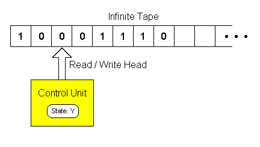
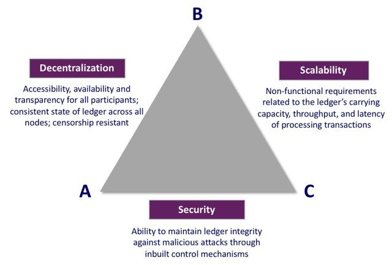

# Ethereum

## Introduction to Cryptocurrency

### Examples of Cryptocurrencies
- Examples: Tether, Cardano, Bitcoin, BNB Coin, Ethereum, Litecoin
- Each cryptocurrency has a different utility or purpose.

### Definition of Cryptocurrency
- **Cryptocurrency**: Any form of currency that exists digitally or virtually and uses cryptography to secure transactions.
- Cryptocurrencies do not have a central issuing or regulating authority.
- They use a decentralized system to record transactions and issue new units.
- There are many different types of cryptocurrencies; some are simply currencies, while others can be considered platforms.
- Currently, there are 9993 coins listed on [CoinMarketCap](https://coinmarketcap.com).

### White Papers
- **White Paper**: A document released by developers that explains the technology and purpose of the project.
- Characteristics defined in a white paper:
  - Why the project was created.
  - The project's real-world utility.
  - Consensus mechanism.
  - Initial coin distribution.
  - Technical explanation (math, cryptography, formulas, etc.).
  - Timeline (ICO, releases, etc.).
- Initial Coin Offering (ICO):
  - Similar to an IPO (Initial Public Offering) but for coins.
  - Coins are initially released to a small set of people before being offered to the public or listed on major exchanges.

### Fiat Currency
- **Fiat Currency**: Government-issued currency that is not backed by a commodity such as gold.
- Examples: US Dollar, Indian Rupee.
- Fiat currency gives central banks greater control over the economy by controlling circulation.
- Fiat money is backed only by the faith of the controlling government.
- Poor monetary policy or corrupt governments can cause hyperinflation and devalue currencies.
  - Example: In 2018, Venezuela experienced a 65,374% inflation rate year over year.
  - From 1960-2021, the average inflation in the USA was 3.8% year over year.

### Underlying Networks and Blockchains
- **Is it true every cryptocurrency uses its own underlying network/blockchain?**
  - **Answer**: No. Many cryptocurrencies utilize the same underlying technology/blockchain.
  - Cryptocurrencies like Bitcoin and Ethereum have their own entirely separate blockchains.
  - Many tokens build on top of existing networks like the Ethereum blockchain and utilize its technology to provide their tokens.
  - These tokens may behave differently than the blockchain's native coin but still rely on the underlying network.

## Ethereum Basics

### Bitcoin
- A limited system used only to decentralize finance.
- The original cryptocurrency, thought of as a form of digital gold.
- Not the best cryptocurrency; it cannot be scaled easily.
- Turing incomplete (there are only limited things that you can do in the Bitcoin network).
- Only capable of understanding a limited instruction set.

### Introduction to Turing Completeness
- All modern programming languages are Turing complete (Python, C++, JavaScript, etc.).
- To be Turing complete, a language needs to be able to do anything a Turing machine can do.
- A Turing machine is an endlessly long piece of tape with a read/write head that can read/write 0's and 1's in the cells on the tape. This allows anything to be computed.
- Alan Turing invented computer science and the idea of the computer.

#### Turing Machine Example

- The tape is infinite in both directions with only finitely many non-blank cells at any time.

#### Turing Machine Requirements
- Must be able to perform conditional branching:
  1. Jump/go to blocks
  2. If, then, else
- Can express any possible program:
  1. Loops and/or recursion
  2. Repeat until (while loops)
  3. May contain infinite loops
- You cannot predict or prove the final state of a Turing complete language.
- Bitcoin is Turing incomplete. This means the final state of any program can be proven before running it.

### Introduction to Ethereum
- Turing complete.
- Not only provides decentralized finance but is also considered a decentralized development platform.
- Allows the development and usage of decentralized apps with the use of the native Ether tokens.
- Has a programming language called Solidity that allows you to write code (smart contracts) hosted on the blockchain.
- Smart contracts allow for programs/applications that implement voting, games, exchanges, auctions, and much more to be decentralized.
- Ethereum's goal is to decentralize the internet, not just finance.

### Smart Contracts and DApps
#### Smart Contracts
- Programs that are stored on the blockchain and run when predetermined conditions are met.
- Executed on nodes.
- Used to automate the execution of an agreement so that all participants are immediately certain of the outcome.
- Properties of smart contracts:
  - Immutable
  - Transparent/public
  - Executed by nodes on the network.
  - Cost money (crypto) to deploy.
  - Can have a balance, just like a regular address.
  - Only run when called and provided gas (a.k.a fee).
  - All operations are traceable and irreversible.
  - Anyone can deploy a smart contract, but once deployed, they cannot be changed or deleted; only upgraded.
  - Cannot make HTTP requests to other sites or rely on any data outside of the blockchain.
- DApps (decentralized apps) are made up of one or multiple smart contracts.

#### DApp Examples
- Auctions
- Games (chess, blackjack, poker, etc.)
- Sale of assets
- Decentralized exchanges (Uniswap, PancakeSwap)
- Web browsers (Brave)
- Credit services (MakerDAO)
- DAOs (Decentralized Autonomous Organizations)

## ERC-20 Tokens

### Coins & Tokens
- **Coins**: The native/default currency for a blockchain network. Examples: Ether, Bitcoin, XRP.
- **Tokens**: Created on a blockchain network using a smart contract. Examples: Tether (ERC-20 on Ethereum), Chainlink, DAI.

### Fungible vs. Non-Fungible Tokens
- **Fungible Tokens**: Tokens that are interchangeable with other tokens of the same type. They follow a standardized protocol known as ERC-20 on the Ethereum network.
- **Non-Fungible Tokens**: Unique tokens representing unique assets, such as pieces of art (e.g., NFTs).

### ERC-20 Tokens
- ERC-20 tokens can be created by anyone by deploying a smart contract that follows the ERC-20 protocol.
- The ERC-20 protocol aims to standardize token functionality.
- ERC-20 smart contracts define:
  - Total token supply
  - How tokens are created or deleted
  - If and how tokens can be transferred
  - Much more.
- There are over 450,000 ERC-20 tokens in existence.

### ERC-20 Token Use Cases
- **Crowdfunding**: Tokens can be bought in exchange for company shares.
- **Voting Rights and DAOs**: ERC-20 tokens can grant voting rights in a group or DAO.
- **Representation of Ownership**: Tokens can represent ownership of assets like gold, though trust in the issuer is required.
- **Paying for Features/DApps**: Tokens can be used for transactions in place of Ether, simplifying calculations for features or services.
- **Enterprise Software**
- **Stablecoins**
- **Royalties**

## ERC-721 Tokens (NFTs)

### Non-Fungible Tokens
- ERC-721 tokens follow a standardized protocol for unique assets on the Ethereum network.
- **Non-Fungible**: Unique tokens representing unique assets, such as pieces of art (e.g., NFTs).

### ERC-721 Tokens
- ERC-721 tokens can be created by anyone by deploying a smart contract that follows the ERC-721 protocol.
- Each ERC-721 token has a unique ID.
- Each token may be associated with metadata such as:
  - Image hash or image link
  - Videos
  - Sound
  - Attributes
- ERC-721 tokens are useful for providing ownership of unique items.

## Blockchain Comparisons

### Scalability, Security, and Decentralization
- **Trade-offs**: Achieving scalability and security often impacts decentralization. Picking a side in the blockchain trilemma (Scalability, Security, Decentralization) means compromising one for the other two.

### Layer-1
- **Definition**: Refers to the base network, such as Bitcoin, BNB Chain, or Ethereum, and its underlying infrastructure.
- **Scalability**: Improving scalability is challenging as it often requires significant changes to the network's infrastructure (e.g., Ethereum's transition from Proof of Work to Proof of Stake).
- **Validation**: Can validate and finalize transactions without relying on another network.
- **Examples**: Solana, Bitcoin, BNB, Cardano, Ethereum.

### Layer-2
- **Definition**: Refers to secondary frameworks or protocols built on top of an existing blockchain.
- **Function**: Performs computations or transactions off-chain and reports back to the main chain for validation. Includes solutions like rollups, state channels, and sidechains.
- **Benefits**: Provides higher throughput, faster transaction processing, and often lower fees.
- **Drawback**: Often lacks decentralization due to limited adoption and usage.

### Layer-1 & Layer-2 Chain Examples
- **Layer-1 Chains**: Solana, Bitcoin, BNB, Cardano, Ethereum.
- **Layer-2 Chains**: Arbitrum, Bitcoin Lightning Network, Optimism.
- **Note**: Layer-1 chains are independent and validate their own transactions, while Layer-2 solutions are built on top of Layer-1 to increase scalability and may lack decentralization.

## Stablecoins

### Definition
- **Stablecoin**: A cryptocurrency asset designed to maintain a stable buying power. It is a non-volatile cryptocurrency asset, useful as a medium of exchange due to the volatility of most cryptocurrencies.
- **Characteristics**: Can be pegged to fiat currencies like the U.S. Dollar, tangible assets like gold, or other cryptocurrencies. They aim to achieve price stability through reserve assets or algorithmic formulas.

### Properties
- **Relative Stability**: Maintains consistent value.
- **Stability Method**: Mechanism used to achieve stability.
- **Reserve Assets**: Assets held to support the stablecoin's value.

### Core Uses
- **Storage of Value**: Preserves value over time.
- **Medium of Exchange**: Facilitates transactions.
- **Unit of Account**: Measures value.

### Types of Collateralization
- **Fiat-Collateralized**: Stablecoins backed by fiat currency (e.g., USD, CAD, EUR). They are typically audited and must hold at least $1 for each coin minted.
- **Crypto-Collateralized**: Stablecoins backed by other cryptocurrencies. They usually hold excess amounts in reserve due to the volatility of cryptocurrencies.
- **Algorithmic Stablecoins**: Maintain price stability by adjusting the supply of coins using smart contracts or algorithms.
- **Endogenous**: Reserve assets originate within the protocol itself.
- **Exogenous**: Reserve assets originate outside the protocol.

## Introduction to Oracles

- **Definition**: Oracles are entities or devices that connect deterministic blockchains with off-chain data.
- **Purpose**: Smart contracts are limited to data within the blockchain ledger and cannot make HTTP requests. Oracles bridge this gap by providing external data.
- **Function**: Oracles provide reliable information from outside the blockchain to smart contracts, enabling them to utilize third-party data (e.g., APIs).
- **Characteristics**:
  - **Trusted Third Parties**: Oracles are typically operated by trusted entities.
  - **Off-Chain Oracles**: These send data to the blockchain through transactions, allowing smart contracts to access and validate the information.

## Chainlink

- **Overview**: Chainlink is a Layer-2 solution that operates on Ethereum, serving as a bridge between blockchain networks and external data sources.
- **Role**: Known as blockchain middleware, Chainlink facilitates the connection between smart contracts and off-chain data.
- **Node Operation**:
  - To become a Chainlink node operator and provide data to the blockchain, operators must stake currency (collateral).
  - Multiple operators provide the same data to ensure its validity.
  - Incorrect data submissions by a node operator can result in the loss of collateral.
- **Reliability**: Chainlink assesses node reliability and directs data requests to trusted nodes to maintain data accuracy.

