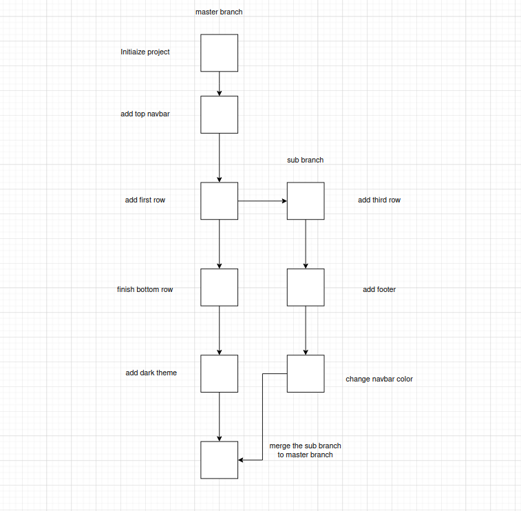
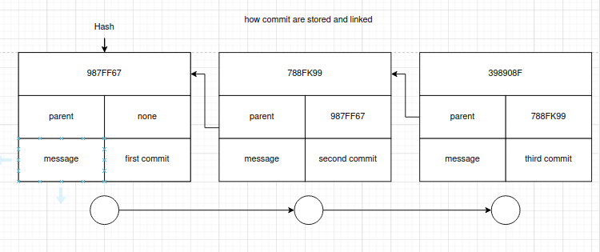

# Git Notes

## What is Git
Git is the world's most popular version control system.

## Version Control
Version control is software that tracks and manages changes to files over time.  
Version control systems generally allow users to revisit earlier versions of the files, compare changes between versions, undo changes, and a whole lot more.  
Git is just one of the version control systems (VCS); there are many VCS like it.     

## Git vs GitHub
- **Git** is the version control software that runs locally on your machine. You don't need to register for an account or have the internet to use it. You can use Git without ever touching GitHub. Git is primarily a terminal tool.
- **GitHub** is a service that hosts Git repositories in the cloud and makes it easier to collaborate with other people. You need to sign up for an account to use GitHub. It’s an online place to share work that is done using Git.

## Download and Install Git
`git --version # gives the version of git`

## Configuring Git
Always configure Git because it helps to identify who committed or made changes to the project.

### How to Configure
`git config --global user.name "Your Name"`  
`git config --global user.email "Your Email"` # always provide the email associated with GitHub

## Repository
A Git "repo" is a workspace or a folder that tracks and manages files within a folder.  
Anytime we want to use Git with a project, we need to initialize Git in that project using the `git init` command.  
Do not run `git init` multiple times inside a folder and don't create a repo inside a repo.

## Committing
Git committing is nothing but saving the current state of the project.     
    
## Adding
We use the `git add` command to stage the changes to be committed. It’s a way of telling Git "please include this change in our next commit". Use `git add` to move files to the staging area.

### Example
`git add file1 file2`  
`git add . # adds all changes to the staging area`  
`git add server1 # adds entire server1 directory to the staging area`

## Commit
`git commit -m "my message" # saves everything that is present in the staging area`    

## Amending Commit
Suppose you forgot to add a file in a commit. Rather than making a brand new separate commit, you can "redo" the previous commit using the `--amend` option.
`git commit -m "some commit"`  
`git add forgotten file`  
`git commit --amend`

## Best Practices
- Commit early and often.
- Make commits atomic (group similar changes together, don’t commit a million things at once).
- Write meaningful but concise commit messages.

### Atomic Commits
When possible, a commit should encompass a single feature, change, or fix. In other words, try to keep each commit focused on a single thing. This makes it much easier to undo or rollback changes later on. It also makes your code or project easier to review.

## .gitignore
Example: (add your `.gitignore` content here)

## Branches
Think of branches as alternative timelines for a project. If we make changes on one branch, they do not impact the other branches (unless we merge both branches).

## The Master Branch

## What is HEAD
We often come across the term HEAD in Git. HEAD is simply a pointer that refers to the current "location" in your repository. It points to a particular latest commit in the current branch by default.

## Viewing Branches
`git branch # list all branches in the repo, look for the * symbol which indicates the branch you are currently on`  
`git branch <branch name> # to create a new branch`

## Switching Branches
`git switch <branch name>`  
`git checkout <branch name>`  
`git switch -c <branch name> # creates a branch and switches to it in a single command`

**Note:** If you're on a branch and have uncommitted work, switching branches will give an error. If you create a new branch and create a new file in that branch, and that file is not staged or committed yet, switching branches will carry that file with you (so always add & commit changes before switching branches).

`git branch -d <branch name> # deletes the branch, you can't delete the current branch`  
`git branch -D <branch name> # force delete`  
`git branch -m <new_name> # renaming the current branch`

## Merge Conflicts
When merge conflicts occur, you have to resolve them manually by editing each conflicting file. Git marks the conflicts in the files, which you need to resolve.

### Resolving Conflicts
Follow these steps to resolve conflicts:
1. Open the file with merge conflicts.
2. Edit the file to remove conflicts. Decide which branch’s content to keep or if both should be kept.
3. Remove the conflict "markers" from the file.
4. Add your changes and make a commit.

## Comparing Changes
`git diff` compares changes that are not staged or committed to the last commit.

### Examples
- `git diff HEAD` lists all changes in the working tree since the last commit.
- `git diff --staged` shows changes that are staged for the next commit.
- `git diff --cached` is similar to `--staged`, showing changes that are staged for the next commit.
- `git diff HEAD <filename>` shows differences between the working tree and the last commit for a specific file.
- `git diff --staged <filename>` shows differences between the staged version and the last commit for a specific file.

## Compare Branches
To compare the differences between two branches:   
`git diff branch1..branch2`

## Git Stash
`git stash` temporarily shelves (or stashes) changes you’ve made to your working directory so you can work on something else, and reapply them later.

### Commands

- `git stash`  
  Shelves changes in your working directory and reverts to the last commit state.

- `git stash pop`  
  Applies the most recent stash and removes it from the stash list.

- `git stash apply`  
  Applies the most recent stash without removing it from the stash list.

- `git stash list`  
  Lists all stashes you’ve made.

- `git stash drop stash@{2}`  
  Deletes a specific stash from the stash list (e.g., stash@{2}).

- `git stash clear`  
  Deletes all stashes.

# Git Checkout and Restore Commands

The `git checkout` command is like a Git Swiss Army knife. Many developers think it is overloaded, which led to the addition of the `git switch` and `git restore` commands. You can use `checkout` to create branches, switch to new branches, restore files, and undo history.

### Commands

- `git checkout <commit-hash>`  
  Switches to a specific commit. Only the first 7 digits of the hash are required. You’ll see a message indicating you are in a 'detached HEAD' state. You can look around, make experimental changes, and commit them. You can discard any commits made in this state by switching back to a branch.

#### What You Can Do in Detached HEAD
1. Stay in detached HEAD to examine the content of the old commit. Poke around and view the files.
2. Leave and go back to where you were before.
3. Create a new branch and switch to it to make and save changes, as HEAD is no longer detached.

- `git checkout HEAD~1`  
  Moves one commit back from the current HEAD.

- `git checkout HEAD <filename>`  
  Reverts the file back to its state at the last commit.

#### Examples
- `git checkout HEAD cat.txt dog.txt`  
  Reverts `cat.txt` and `dog.txt` to their state at the last commit.

## Git Restore
- `git restore <file-name>`  
  Restores a file to its state in the working directory.

- `git restore --source HEAD~1 <file-name>`  
  Restores a file to its state from one commit before the current HEAD.

### Unstaging Files with Restore
- `git restore --staged <file-name>`  
  Unstages a file that was added to the staging area.

## Undo Commits
- `git reset <commit-hash>`  
  Resets the current branch to a specific commit. Does not remove changes from the working directory.

- `git reset --hard <commit-hash>`  
  Resets the current branch to a specific commit and discards all changes in the working directory.

- `git revert <commit-hash>`  
  Creates a new commit that undoes the changes made in a specific commit.

## Github commands
`
### Clones a remote repository to your local machine.
Example:
- `git clone https://github.com/username/repository.git`

### Lists the remote repositories associated with your local repository.
Example:
- `git remote -v`

### Adds a new remote repository.
Example:
- `git remote add origin https://github.com/username/repository.git`

### Fetches changes from a remote repository without merging them.
Example:
- `git fetch origin`

### Fetches and merges changes from a remote repository into your current branch.
Example:
- `git pull origin main`

### Pushes changes from your local branch to a remote repository.
Example:
- `git push origin main`
