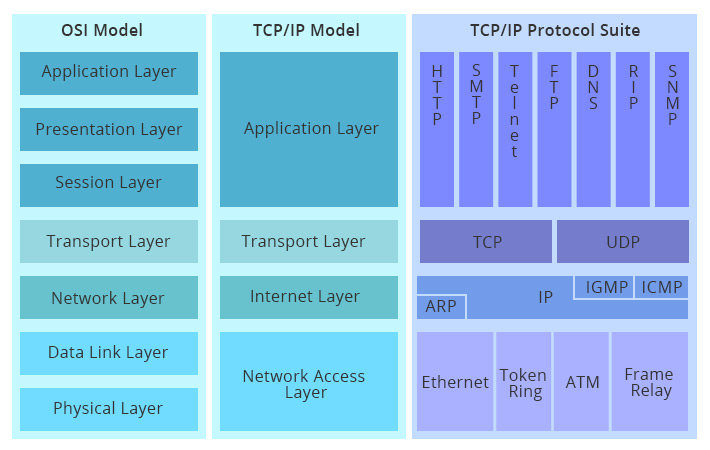
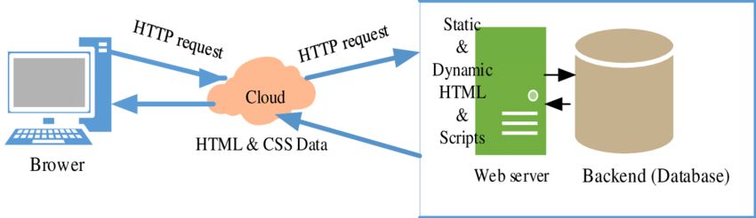

### Online
- **Definition**: Being online means being connected to a network, usually the global internet. An end-user device is connected to other devices through this network.
- **Communication Pathways**: Between the sender and receiver, there can be multiple pathways (e.g., 10, 50, 100) that a message can take. Intermediary devices along the way determine the path the communication will take.

### What is the Internet?
- **Definition**: The internet is a worldwide collection of interconnected networks that cooperate to exchange information using common standards. Through telephone wires, fiber optic cables, and wireless transmission, everything accessible online is located somewhere on the global internet, including social media, websites, multiplayer games, and messages.

### Local Network
- **Definition**: Local networks come in various sizes, ranging from two computers to thousands of computers.
- **SOHO Networks**: Small Office/Home Office networks, designed for smaller-scale connectivity needs.

### What is Data?
- **Definition**: Data is the information that you input into a system.
- **Types**:
  - **Volunteered Data**: Data that you provide willingly, agreeing to share or store it on the network.
  - **Inferred Data**: Data that is derived from your activities, such as credit card transactions, even if not explicitly volunteered.
  - **Observed Data**: Data collected from your activities, like location tracking on your phone, which is transmitted to your carrier.
  - **Note**: This collected data contributes to what is known as "big data" in the cloud.

### How is Data Stored?
- **Definition**: Data stored on digital media like computers or disk drives is not in the form of letters and characters but as bits.
- **Bits**: Bits are binary digits, meaning they are represented as ones and zeros.
- **Storage**: Each character, voice input, or video is stored as a series of ones and zeros. ASCII is a standard that converts these binary representations into readable characters.

### Getting Bits Moving
- **Definition**: After data is converted into bits, it must be transmitted across network media to its destination.
- **Media**: Refers to the physical medium on which signals are transmitted, such as copper wire, fiber optic cables, or electromagnetic waves through the air.
- **Signals**: Consist of electrical or optical patterns representing digital bits. These signals travel from the source to the destination, potentially converting between different types of media along the way.
- **Methods of Signal Transmission**:
  - **Electrical Signals**: Achieved by representing data as electrical pulses on copper wire.
  - **Optical Signals**: Achieved by converting electrical signals into light pulses.
  - **Wireless Signals**: Achieved by using infrared, microwave, or radio waves through the air.       


### The Mighty Bit

- **Binary Digits**:
  - **Definition**: Computers and networks work exclusively with binary digits, or bits, which can only be 0 or 1. The term "bit" is an abbreviation of "binary digit" and represents the smallest piece of data.
  - **Binary System**: All data, whether it be text, images, or videos, is stored and transmitted as a series of bits. Each bit has one of two possible values: 0 or 1.

- **Interpretation of Data**:
  - **Human vs. Computer**: Humans interpret words and pictures, while computers interpret patterns of bits. For example, a bit stored and transmitted can represent two discrete states, such as two directions of magnetization, two distinct voltage or current levels, or two levels of light intensity.
  - **Physical Representation**: A light switch can be either on or off, which corresponds to 1 and 0 in binary representation.

- **Input Devices**:
  - **Translation**: Input devices such as mice, keyboards, and voice-activated receivers convert human interactions into binary code for the CPU to process and store.

- **Output Devices**:
  - **Translation**: Output devices like printers, speakers, and monitors take binary data and convert it back into a human-recognizable form.

- **Data Processing**:
  - **Internal Processing**: Within the computer, all data is processed and stored as binary. This uniformity allows for consistent and efficient data handling and storage across different systems and applications.


### Throughput

- **Definition**: Throughput is the amount of data sent and received over a connection, including any delays that might occur. This includes delays in both directions.
  - **Download Speed**: 35.70 Mbps (35 million bits per second)
  - **Upload Speed**: 35.04 Mbps

- **Bandwidth vs. Throughput**:
  - **Bandwidth**: Refers to the maximum amount of data transfer per second. For example, a pathway can provide a bandwidth up to 1 Gbps, indicating its capability.
  - **Throughput**: The actual amount of data passing through the media or connection. It reflects what happens in a real-world scenario, as opposed to theoretical maximums.
  - **Latency**: Refers to the amount of time, including delays, for data to travel from one point to another.

- **Units of Bandwidth**:
  - **Bits per Second**: b/s (1 b/s)
  - **Thousand Bits per Second**: kb/s (1000 b/s = 10³ b/s)
  - **Million Bits per Second**: Mb/s (10⁶ b/s)
  - **Billion Bits per Second**: Gb/s (10⁹ b/s)
  - **Trillion Bits per Second**: Tb/s (10¹² b/s)

### Clients and Servers

- **Role Determination**:
  - **Server Software**: Determines if a computer acts as a server. Examples include Node.js, Nginx, Apache.
  - **Client Software**: Determines if a computer acts as a client. Examples include Chrome, Mozilla Firefox.

### Network Infrastructure Symbols

- **Intermediate Devices**:
  - **Router**: Directs data packets between networks.
  - **Wireless Router**: Combines router functionality with wireless access.
  - **Switch**: Connects devices within a network and manages data traffic.
  - **Wireless Access Point**: Provides wireless connectivity to a network.

- **End Devices**:
  - **Laptop**: Portable computer.
  - **Printer**: Output device that produces physical copies of digital documents.
  - **Tablet**: Portable touch-screen device.
  - **Phone**: Mobile communication device.
  - **Desktop**: Stationary computer.
  - **Server**: Provides services or resources to other computers over a network.      


### Connecting End-User Devices

- **Network Interface Card (NIC)**:
  - **Purpose**: The NIC is a hardware component that enables an end-user device to connect to a network, whether wired or wireless. It may be integrated into the device's motherboard or installed separately as a card.

- **Configuration**:
  - **Operating System Configuration**: In addition to the physical connection, proper configuration of the operating system is required for the device to participate in the network.

- **IP Configuration**:
  - **IP Address**: Identifies the host on the network.
  - **Subnet Mask**: Used to identify the network on which the host is connected.
  - **Default Gateway**: Identifies the networking device (such as a router) that the host uses to access the internet or another remote network.

- **Additional Note**:
  - **DNS Server**: A DNS server translates domain names (e.g., www.example.com) into their corresponding IP addresses, allowing devices to locate each other on the network.


### What is a Computer Network?

- **Definition**: A network is essentially two computers connected to each other by a single cable. In its simplest form, a network is just "two connected computers sharing resources (data, files, images, PDFs) with one another."           

- **Components**:
  - **Physical Connection**: This includes wires, cables, and wireless media. For example, a Network Interface Card (NIC) in one PC is connected to another NIC in a different PC, exchanging data using cables or radio waves.
  - **Logical Connection**: Refers to the data transport across the physical media.

### Basic Networking Rules

- **Communication Protocols**:
  - Computers in a network must use the same procedures for sending and receiving data, known as "communication protocols."
  - **Example**:
    - To call your friend, you must know their phone number, ensure a good connection, make the phone ring, and both must speak the same language.
  - Data sent by a computer (sender) must be delivered uncorrupted; if it is corrupted, it becomes useless.
  - Computers must determine the "origin" and "destination" of a piece of information, i.e., its "IP address" and "MAC address."

### Why Build a Network?

- **Efficiency**: Networks enable faster and more efficient communication modes such as email and video conferencing.
- **Standardization**: Encourages the use of standard policies and procedures (protocols).
- **Backup and Recovery**: Provides support for data backup and recovery (redundancy).
- **Cost Savings**: Leads to financial savings.
- **Instant Communication**: Supports online banking, world news, weather forecasts, and traffic conditions.
- **Benefits**:
  - Instant messaging
  - Creating blogs, pages, websites
  - Podcasting
  - Online teaching (e.g., courses on Udemy)
  - Working remotely
  - Platforms like YouTube, online games, etc.
  - Centralized file management for companies
  - Shared resource capabilities
  - Centralized security and configuration management
  - Greater productivity and cost savings

### Introduction to Computer Networking Protocols

- **Network Protocols**: Rules governing how machines exchange data and enable effective communication.
  - **Examples**:
    - Calling someone: Pick up the phone, ensure a dial tone, and then dial the number.
    - Driving: Follow road rules.
  - **Types of Protocols**:
    - **Physical Protocols**: Describe the medium (wiring), connections (e.g., RJ-45 port), and signals (e.g., voltage levels on a wire).
    - **Logical Protocols**: Software controlling how and when data is sent and received, supporting physical protocols.

- **Common Protocols**:
  - **Web Communication**: HTTP
  - **Email**: POP3, SMTP, IMAP
  - **File Transfer**: FTP

### The OSI Model

- **Definition**: The Open Systems Interconnection (OSI) reference model is a conceptual framework that describes how data moves through a network. It was never implemented but is used for understanding network operations.

- **Purpose**: To provide a guide to understand how networks operate or work "behind the scenes."

- **Real-World Implementation**: The OSI model is a reference model, not implemented in the real world. The TCP/IP model is used in practice.

- **Historical Context**: Initially, two groups developed the OSI and TCP/IP models. TCP/IP was preferred for implementation, but OSI is used for educational purposes and troubleshooting.

### The OSI Model Stack

- **Layers**:
  - **Upper Layers (Host Layers)**: Handled by the "host computer" and perform application-specific functions, such as data formatting, encryption, and connection management.
  - **Lower Layers (Media Layers)**: Provide network-specific functions, such as routing, addressing, and flow control.          


### OSI Model and Data Transmission

When sending data to another person, the data does not only travel to the receiver. Each layer in the OSI model adds some information to the data as it moves from top to bottom. The seven layers of the OSI model each add their own header or metadata to the data. When the receiver gets the data, it needs to remove these layers from bottom to top to retrieve the original message.

- **Sending Data**: Each layer in the OSI model adds its own header information to the data as it moves down through the layers.
  - **Top-to-Bottom**:
    1. **Application Layer**: Adds application-specific data.
    2. **Presentation Layer**: Adds data representation and encryption information.
    3. **Session Layer**: Manages sessions and adds session information.
    4. **Transport Layer**: Adds transport information such as ports and error correction.
    5. **Network Layer**: Adds routing and addressing information.
    6. **Data Link Layer**: Adds physical addressing and error detection information.
    7. **Physical Layer**: Converts the data into bits for transmission.

- **Receiving Data**: Each layer on the receiving side strips off its corresponding header information to reconstruct the original data.
  - **Bottom-to-Top**:
    1. **Physical Layer**: Receives bits and converts them into data.
    2. **Data Link Layer**: Removes the data link header and performs error checking.
    3. **Network Layer**: Removes the network layer header and processes routing information.
    4. **Transport Layer**: Removes the transport header and processes error correction.
    5. **Session Layer**: Removes the session layer header and manages session information.
    6. **Presentation Layer**: Removes the presentation layer header and processes data representation.
    7. **Application Layer**: Delivers the final data to the application.

### Programmers and the OSI Model

- **"Programmers do not throw sausage pizza away"**: This phrase is a mnemonic to remember the OSI layers in the correct order. It stands for:
  - **S**: **S**ession Layer
  - **P**: **P**resentation Layer
  - **T**: **T**ransport Layer
  - **N**: **N**etwork Layer
  - **D**: **D**ata Link Layer
  - **P**: **P**hysical Layer

  The layers are often remembered in the order of:
  - **Application**
  - **Presentation**
  - **Session**
  - **Transport**
  - **Network**
  - **Data Link**
  - **Physical**

### OSI Communication Example

- **Scenario**: A user needs to communicate with a file server and wants to save a file on the server.
  - The user's computer will send the file data to the server.
  - As the data travels through the network, each OSI layer adds its own header or information to the data.
  - Once the data reaches the file server, each OSI layer on the server side removes the corresponding header or information to process the data correctly.
  - Finally, the file server saves the file as requested by the user.      
          
     


### TCP/IP Model

The **TCP/IP suite** is the most commonly used protocol suite in the networking world and forms the basis of the internet. When you connect to websites like Facebook, banks, or online games, you are using a TCP/IP connection.

#### Key Points:
- **TCP/IP** is the standard for computer networking.
- It was the foundational protocol suite on which the internet was built.
- The TCP/IP model is based on a **4-layer** architecture, which is similar to but simpler than the OSI model.

#### TCP/IP Model Layers:

1. **Application Layer**:
   - **Function**: Handles high-level protocols, data representation, and application services.
   - **Examples**: HTTP (web browsing), FTP (file transfer), SMTP (email).

2. **Transport Layer**:
   - **Function**: Manages end-to-end communication and data transfer. It ensures complete data transfer and error handling.
   - **Protocols**: 
     - **TCP (Transmission Control Protocol)**: Provides reliable, connection-oriented communication.
     - **UDP (User Datagram Protocol)**: Provides unreliable, connectionless communication.

3. **Internet Layer**:
   - **Function**: Responsible for logical addressing and routing of data packets across the network.
   - **Protocols**:
     - **IP (Internet Protocol)**: Handles addressing and routing of packets.
     - **ICMP (Internet Control Message Protocol)**: Handles error messages and operational information.

4. **Network Interface Layer**:
   - **Function**: Deals with the physical network hardware and data link protocols.
   - **Responsibilities**: Includes framing of packets, handling physical addressing (MAC addresses), and error detection.

#### Comparison to OSI Model:
- The TCP/IP model is less granular than the OSI model but is more practical for real-world implementation.
- The 4 layers of TCP/IP correspond to the 7 layers of the OSI model, with some combining multiple OSI layers into a single TCP/IP layer.

**Example Use Case**:
- When you access a website, the TCP/IP model facilitates the transmission of data between your computer and the web server. The data is broken down into packets at the Application Layer, managed and transmitted reliably at the Transport Layer, routed across networks at the Internet Layer, and finally transmitted over the physical network at the Network Interface Layer.          




# Introduction to MAC Addresses

## MAC Address

- A physical address (permanent).
- IP address is a logical address (changes).

## Media Access Control (MAC) Address

- Physical address of the network adapter card.
- MAC address on NIC is never going to change.
- The MAC address operates on OSI Layer 2 (Data Link).
- The MAC address operates on TCP/IP Network Interface Layer address.
- MAC address is composed of six bytes (48 bits), usually represented in hexadecimal.
  - First three bytes (24 bits) are assigned by IEEE to the manufacturer.
    - OUI (Organizationally Unique Identifier) assigned by IEEE (e.g., Dell or HP).
  - Last three bytes (24 bits) are usually assigned sequentially:
    - Allows for uniqueness; duplications are rare.
    - Example: `00:21:70:6f:06:f2` -> `00-21-70-6F-06-F2`
    - `2^24 = 16.7 million unique addresses`.
- To find your MAC address, **open Terminal and type**:
    ```bash
    ipconfig /all
    ```
- Look for the "Physical Address" field (e.g., `00-02-6F-93-FA-9D`).

# IPv4 Addresses

## IPv4 Address

- A logical address assigned to a network device by the network itself.
- Internet Protocol Version 4:
  - OSI Layer 3 (Network Layer) address.
  - Example: `192.168.1.131`.
  - Binary Representation: `11000000.10101000.00000001.10000011`.
  - 32 bits (4 bytes) with dotted decimal notation.

## Viewing IPv4 Address

- **Open Terminal and type**:
    ```bash
    ipconfig /all
    ```
- Example output might include:
    - IPv4 address: `172.168.169`
    - IPv6 address: (if available)

# Comparing IP and MAC Addresses

## IP Address

- IP addresses are used on OSI Layer 3 (Network Layer).
- Logical addresses.
- Format: Dotted decimal notation (e.g., `192.168.1.131`).
- Allows network-to-network communication via routers (WAN communication).

## Usage

- An IP address is used to communicate between networks.
- For example:
  - In a home network setup with a laptop, desktop, and network printer, the MAC address is used for local communication on that network.
  - For broader network communication (e.g., accessing Gmail, YouTube, Facebook), IP addresses are used.

            
# MAC Addresses

## Overview

- **MAC Address**: Media Access Control address.
- Operates at the **Data Link Layer** (OSI Layer 2).

## Characteristics

- **Physical Address**:
  - MAC addresses are physical addresses that are hardcoded into the Network Interface Card (NIC).
  - They are unique to each NIC and do not change.

- **Address Assignment**:
  - The MAC address is burned into the NIC by the manufacturer.
  - Typically represented in hexadecimal format, e.g., `00:21:70:6f:06:f2`.

- **Usage**:
  - Used for local network communication.
  - Allows devices on the same network to communicate directly via hubs, switches, and routers.
  - **Internetwork Communication**: MAC addresses are used for communication within a specific local network (LAN) but are not used for network-to-network communication.

## MAC Address Functionality

- **Local Communication**:
  - MAC addresses facilitate communication between devices on the same local network.
  - Devices use MAC addresses to send data within a LAN.

- **Network Devices**:
  - Hubs: Broadcast data to all devices within a LAN.
  - Switches: Forward data specifically to the device with the matching MAC address.
  - Routers: Use MAC addresses to handle local network traffic and may use IP addresses for routing between different networks.

## Example

- A MAC address might look like: `00-21-70-6F-06-F2`
- **Hexadecimal Format**: Six pairs of hexadecimal digits, separated by colons or hyphens.

## Summary

- MAC addresses are essential for communication within a local network and are used to identify devices on that network uniquely. They operate at the Data Link Layer (OSI Layer 2) and are integral to network operations involving local communication devices.


# Introduction to IPv6

## What is IPv6?

- **IPv6** (Internet Protocol Version 6) is the most recent version of the Internet Protocol, designed to replace IPv4.
- IPv6 was developed to address the limitations of IPv4, primarily the exhaustion of available IP addresses.

## Key Features of IPv6

1. **Address Length**
   - IPv6 addresses are 128 bits long, compared to IPv4’s 32-bit length.
   - This increase allows for a vastly larger number of unique IP addresses.
   - Example: An IPv6 address is written in hexadecimal format and consists of eight groups of four hexadecimal digits, separated by colons.
     - Example: `2001:0db8:85a3:0000:0000:8a2e:0370:7334`

2. **Address Space**
   - The address space in IPv6 is significantly larger than IPv4.
   - IPv6 provides approximately `3.4 x 10^38` possible addresses.
   - This addresses the issue of IP address exhaustion seen in IPv4.

3. **Simplified Header Structure**
   - IPv6 headers are simplified compared to IPv4 headers, reducing the processing burden on routers.
   - Certain fields in the IPv4 header are dropped or made optional in IPv6 to streamline packet processing.

4. **No Need for NAT (Network Address Translation)**
   - IPv6 was designed with the idea that every device could have a unique IP address, eliminating the need for NAT.
   - NAT is used in IPv4 to extend the limited address space by allowing multiple devices on a local network to share a single public IP address.

5. **Enhanced Security**
   - IPv6 includes IPsec (Internet Protocol Security) as a fundamental component for securing data communication.
   - This provides encryption and authentication at the network layer.

6. **Auto-Configuration**
   - IPv6 supports stateless address auto-configuration (SLAAC), allowing devices to generate their own IP addresses.
   - Devices can configure themselves automatically when connected to an IPv6 network.

7. **Improved Multicast and Anycast**
   - IPv6 improves support for multicast (sending data to multiple destinations) and introduces anycast (sending data to the nearest of multiple possible destinations).

## Example IPv6 Address

- **Full Format**: `2001:0db8:85a3:0000:0000:8a2e:0370:7334`
- **Compressed Format**: `2001:db8:85a3::8a2e:370:7334`
  - Leading zeros in each block can be omitted.
  - Consecutive blocks of zeros can be replaced with a double colon (`::`), but only once in an address.

## Viewing IPv6 Address

- On Windows, open Command Prompt and type:
    ```bash
    ipconfig
    ```
- On Linux or macOS, open Terminal and type:
    ```bash
    ifconfig
    ```
- Example output might include:
    - IPv6 address: `fe80::1a2b:3c4d:5e6f:7g8h`

## Transition from IPv4 to IPv6

- The transition from IPv4 to IPv6 is ongoing and involves techniques like dual-stack (running IPv4 and IPv6 simultaneously) and tunneling (encapsulating IPv6 packets within IPv4 packets).

## Summary

IPv6 addresses the limitations of IPv4 by providing a larger address space, simplifying header structure, enhancing security, and supporting modern networking needs.


# Network Topologies

## What is Network Topology?

- **Network Topology**: Refers to the arrangement of various elements (links, nodes, etc.) in a computer network.

## Local Area Network (LAN)

- **Definition**:
  - A collection of computers and other networked devices that fit within the scope of a single physical network.
  - Usually restricted to a particular geographic region.

- **Examples**:
  - Office building
  - Single department within a corporate office
  - Home office
  - Classroom

## Wide Area Network (WAN)

- **Definition**:
  - An internetwork that connects multiple sites and spans large geographic regions.
  - An internetwork is multiple LANs connected together.

- **Characteristics**:
  - Usually employs both routers and public links.
  - Examples: Internet, different buildings on a campus.

- **Comparison with LAN**:
  - Unlike a WAN, a LAN may reside in only a single location.
  - Multiple LANs = 1 WAN

## Peer-to-Peer Architecture

- **Definition**:
  - All computers on the network are peers.
  - No dedicated servers.
  - No centralized control over shared resources.
  - Any individual machine can share its resources as it pleases.
  - All computers on the network can act as either a client (receive resources) or a server (provide resources).

- **Advantages**:
  - Easy to install and configure.
  - Does not depend on the presence of a dedicated server.
  - Individual users control their own shared resources.
  - Inexpensive to purchase and operate.
  - No dedicated administrators are needed to run the network.

- **Disadvantages**:
  - Network security applies only to a single resource at a time.
  - Users may be forced to use as many passwords as there are shared resources.
  - Each machine must be backed up individually to protect all shared data.
  - No centralized organizational scheme to locate or control access to data.

- **Overview**:
  - A peer-to-peer (P2P) network in which interconnected nodes (peers) share resources amongst each other without the use of a centralized administrative system.     

         


## Client/Server Architecture

- **Definition**:
  - The network is composed of clients and servers.
  - Servers provide centralized control over network resources, such as files, printers, authentication, etc.
  - Clients receive resources from servers.
  - Servers provide resources to clients.

- **Advantages**:
  - **Centralized Control**:
    - Access, resources, and integrity of the data are controlled by the dedicated server, preventing unauthorized clients or programs from damaging the system.
  - **Scalability**:
    - Capacity of clients and servers can be increased separately at any given time.

- **Disadvantages**:
  - **Server Failure**:
    - A failure of the server renders the network unusable or results in loss of network resources.
  - **Complexity**:
    - Special-purpose server software requires allocation of expert staff.
  - **Cost**:
    - Dedicated hardware and specialized software add to the cost of ownership.


## Common Networking Components

### Network Devices

- **Modem**:
  - If you want internet access, you need a modem. The modem brings the internet into your home or business.
  - A modem establishes and maintains a dedicated connection to your Internet Service Provider (ISP).
  - A modem uses two types of signals:
    - **Modulator**: Modulates outgoing digital signals into analog signals.
    - **Demodulator**: Demodulates incoming analog signals into digital signals.          
         
- **Router**:
  - A router routes or passes your internet connection to all of your devices.         


- **Switch**:
  - An extension of the router that allows for more than 4 Ethernet connections.

- **Firewall**:
  - A network security system designed to prevent unauthorized access to or from a private network.
  - Can be implemented as both hardware and software, or a combination of both.
  - Network firewalls are used to prevent unauthorized internet users from accessing private networks connected to the internet, especially intranets.
  - All messages entering or leaving the intranet pass through the firewall, which examines each message and blocks those that do not meet the specified security criteria.          


### Common Servers

- **Authentication Server**:
  - Manages user authentication and authorization.

- **File Server**:
  - Stores and manages files for network users.

- **Mail Server**:
  - Handles the sending, receiving, and storage of email.

- **Print Server**:
  - Manages printers and print jobs on the network.

- **Web Server**:
  - Hosts and serves web pages to clients.

- **Application Server**:
  - Hosts and runs applications for client access.

- **Database Server**:
  - Manages databases and provides data access to other servers and clients.


## Network Topology

Network topology is the schematic description of a network arrangement, connecting various nodes (sender and receiver) through lines of connection.

### Bus Topology

- **Bus Topology**: A network type in which every computer and network device is connected to a single cable. When it has exactly two endpoints, it is called a linear bus topology.              

### Star Topology

- **Star Topology**: All the computers are connected to a single hub through a cable. This hub is the central node, and all other nodes are connected to the central node.          

### Ring Topology

- **Ring Topology**: Each computer is connected to exactly two other computers to form a ring. Data travels in one direction around the ring.          

### Mesh Topology

- **Mesh Topology**: Each node is connected to every other node in the network. It provides high redundancy and reliability.        

### Tree Topology

- **Tree Topology**: A combination of star and bus topologies. Groups of star-configured networks are connected to a linear bus backbone.        

### Hybrid Topology

- **Hybrid Topology**: A combination of two or more different types of topologies. It inherits the advantages and disadvantages of the included topologies.         


## Networking Devices

### Networking Interface Card (NIC)

- **NIC**: The NIC is a physical device added inside the motherboard.
    - Provides the physical and electrical connections to the network media.
    - Can either be an expansion card or built directly into the motherboard.
    - The network card operates as a middleman between a computer and a data network.

### Functions of a NIC

- **Data Request Handling**: When a user requests a web page, the computer passes the request to the network card, which converts it into electrical impulses.
- **Signal Conversion**: These impulses are received by a web server on the internet, which responds by sending the web page back to the network card as electrical signals.
- **Data Translation**: The NIC gets these signals and translates them into the data that the computer displays.


## Cabling Devices

When it comes to connecting devices, there are two main options: wired connections and wireless connections.

### Wired Connection

Wired connections involve computers and devices being connected through physical cables. There are two primary types of cables used in wired connections:

#### Copper Cables

- **Cost**: Copper cables are generally cheaper than fiber optic cables, making them a cost-effective choice for many networks.
- **Distance**: These cables are suitable for shorter distances due to signal degradation over long runs.
- **Signal Type**: Data is transmitted and received over electric signals.
- **Interference**: Copper cables can be affected by electromagnetic interference, which can cause signal loss or degradation.

#### Fiber Optic Cables

- **Material**: Made from glass or plastic fibers that transmit data as light signals.
- **Distance**: Ideal for long-distance communication as they experience less signal loss compared to copper cables.
- **Signal Type**: Data is sent as light signals, providing higher bandwidth and speed.
- **Cost**: More expensive than copper cables.
- **Interference**: Not affected by electromagnetic interference, making them more reliable in environments with high interference.

### Wired LAN and Ethernet

- **Ethernet Protocol**: Wired LANs typically use the Ethernet protocol, a set of rules for network communication.
  - **Components**: Ethernet specifies various aspects, such as types of cabling and their supported speeds.
  - **Media Access Control (MAC)**: Part of the Ethernet standard that governs data formatting and transmission.

### Communication Example

- **Workstation and Server Communication**: Consider a workstation with a 1 gigabit per second (Gbps) connection communicating with a server that has a 10 Gbps connection.
  - **Message Preparation**: The workstation formats the message according to MAC rules and sends it using its physical layer capabilities.
  - **Message Reception**: The server receives and decodes the message at the physical layer, preserving the integrity of the data.
  - **Compatibility**: Despite differing network speeds, devices can communicate effectively due to standardized protocols.

### IEEE Standards and Protocols

The Institute of Electrical and Electronics Engineers (IEEE) has established several standards for LAN technologies, including Ethernet:

- **IEEE 802**: Series of standards for LAN technologies.
- **IEEE 802.3**: Standard for Ethernet.
  - **802.3i**: Specifies 10 Mbps Ethernet.
  - **802.3u**: Specifies 100 Mbps Ethernet (Fast Ethernet).
  - **802.3ab**: Specifies 1 Gbps Ethernet (Gigabit Ethernet).
  - **802.3an**: Specifies 10 Gbps Ethernet (10 Gigabit Ethernet).

### Ethernet Terminology

- **10GBase-T**: A type of Ethernet standard.
  - **10G**: Indicates 10 gigabits per second (Gbps) speed.
  - **Base**: Refers to baseband signaling, where the entire bandwidth of the cable is used for one signal.
  - **T**: Stands for twisted pair, indicating the type of cable used (e.g., unshielded twisted pair - UTP).

- **UTP (Unshielded Twisted Pair)**: A common type of Ethernet cable.
  - **Cat5e**: Enhanced Category 5 cable, supports up to 1 Gbps.
  - **Cat6**: Supports up to 10 Gbps over short distances.
  - **Cat6a**: Augmented Category 6, supports 10 Gbps over longer distances.
  - **Cat7**: Supports higher frequencies and bandwidths, with improved shielding.

### Connectors

- **RJ45**: The most common connector used for Ethernet connections. It is used to connect devices to the network using UTP cables.       


## Overview of TCP/IP Networking Model

The TCP/IP model defines and references a large collection of protocols that allow computers to communicate. To define a protocol, TCP/IP uses documents called Requests for Comments (RFCs). To help people understand a networking model, each model breaks the functions into a small number of categories called layers. Each layer includes protocols and standards that relate to that category of functions.          


- The top two layers focus more on the applications that need to send and receive data.
- The bottom layer focuses on how to transmit bits over each individual link.
- The Internet layer focuses on delivering data over the entire path from the original sending computer to the final destination computer.           


## Brief Explanation of the TCP/IP Model

The TCP/IP model is a networking model, architecture, or blueprint that provides a comprehensive set of documents outlining the necessary functions for computer networking. Each document within the model describes a small function required for a network to operate effectively. Collectively, these documents define everything that should happen for a computer network to work.

- **Protocols**: Some documents define a protocol, which is a set of logical rules that devices must follow to communicate.
- **Physical Requirements**: Other documents specify physical requirements for networking. For example, a document could define the voltage and current levels used on a particular cable when transmitting data.

### Requests for Comments (RFCs)
- TCP/IP uses documents called Requests for Comments (RFCs) to define protocols.

### Implementation
- The operating system on the computer implements parts of the TCP/IP model.
- The Ethernet card or wireless LAN card built into the computer implements some LAN standards referenced by the TCP/IP model.

### Layers of the TCP/IP Model
To help people understand a networking model, each model breaks the functions into a small number of categories called layers. Each layer includes protocols and standards that relate to that category of functions.           

- **Top Two Layers**: Focus more on the applications that need to send and receive data.
- **Bottom Two Layers**: Focus on how to transmit bits over each individual link.
- **Internet Layer**: Focuses on delivering data over the entire path from the original sending computer to the final destination computer.


## TCP/IP Application Layer

The TCP/IP application layer protocols provide services to the application software running on a computer. The application layer itself does not define the application but the services that applications need. 

### Services Provided by the Application Layer
For example, the HTTP protocol defines how web browsers can pull content from a web server. In short, the application layer provides an interface between software running on a computer and the network itself.

### HTTP Protocol Mechanisms

The figure below illustrates how a web browser application and a web server application use a TCP/IP application layer protocol (HTTP) to request a web page and return its contents:            


1. **Requesting a Web Page:**
    - The web browser sends a message with an HTTP header to the web server.
    - HTTP headers contain information used by the protocol. The request typically includes a "GET" command and the name of the file (e.g., `home.htm`). If no filename is mentioned, the web server assumes the default web page is requested.

2. **Server Response:**
    - The web server responds with an HTTP header containing a return code (e.g., `200 OK`), indicating the success of the request. HTTP defines other return codes to inform the browser whether the request worked.

3. **Transferring Data:**
    - The web server sends the requested data in multiple messages, each containing a part of the file. To save space, these additional messages omit the repeated HTTP headers.

### Example of HTTP in Action
- **HTTP (HyperText Transfer Protocol)** was founded by Tim Berners-Lee in 1990.
- HTTP functions allow web browsers to request files from a server and the server to return the content of those files.
- The full version of most web addresses, also called Uniform Resource Locators (URL), begins with "http", indicating that HTTP is used to transfer web pages.

### Detailed Steps of HTTP Communication       
        
1. **Step 1:** To get the web page from Larry, Bob (the client) sends a message with an HTTP header, requesting the file (e.g., `home.htm`).
2. **Step 2:** Larry (the server) responds with an HTTP header containing a return code (e.g., `200 OK`).
3. **Step 3:** Larry sends another message to Bob without an HTTP header, transferring the file content in multiple parts to save space and avoid repeating the same header information.

This mechanism ensures efficient and structured communication between web browsers and web servers, facilitating the seamless retrieval and display of web pages.


## TCP/IP Transport Layer

The TCP/IP transport layer includes two of the most commonly used transport layer protocols: TCP (Transmission Control Protocol) and UDP (User Datagram Protocol). These protocols provide services to the application layer protocols that reside one layer higher in the TCP/IP model.

### Services Provided by the Transport Layer
Transport layer protocols provide essential services to the application layer protocols. One key service provided by TCP is error recovery, ensuring reliable delivery of data across a network.

#### Error Recovery with TCP
Each layer in the TCP/IP model provides a service to the layer above it. For example, TCP offers error-recovery services to application layer protocols. Let's consider an example to understand this concept:

- **Scenario:** Bob's web browser requests a home page from Larry's web server using HTTP. If Bob's HTTP GET request or Larry's HTTP response gets lost in transit through the TCP/IP network, a mechanism is needed to guarantee data delivery.

- **TCP's Solution:** TCP includes an error-recovery feature to address this issue. This feature uses acknowledgments (ACKs) to ensure reliable delivery.        
    
### Example of TCP Error Recovery
In the figure below, Larry's web server sends a web page to Bob's web browser using three separate TCP messages:

1. **Sequence Numbers:** Each TCP segment (message) includes a sequence number (SEQ). This number helps track the order of the segments.
2. **Lost Segment:** In this example, the network fails to deliver the TCP segment with sequence number 2.
3. **Detection of Loss:** Bob's TCP logic receives segments 1 and 3 but does not receive segment 2. Realizing that segment 2 is missing, Bob's TCP logic identifies the loss.
4. **Request for Retransmission:** Bob's TCP logic sends a TCP segment back to Larry, requesting the retransmission of segment 2.

#### Visual Representation:
- **Figure:** Web server Larry sends a web page to web browser Bob using three TCP messages. The sequence numbers help track each message, and when segment 2 is lost, Bob requests Larry to resend it.

### Summary
- **Transport Layer Protocols:** TCP and UDP are the main protocols at this layer.
- **Error Recovery:** TCP's error-recovery mechanism uses sequence numbers and acknowledgments to ensure reliable data delivery.
- **Service to Application Layer:** Transport layer protocols provide crucial services like error recovery to application layer protocols, ensuring data integrity and reliability across the network.

This robust error-recovery feature in TCP ensures that applications relying on TCP can count on reliable data transmission, even in the presence of network issues.


## Same-Layer and Adjacent-Layer Interactions

### Adjacent-Layer Interaction
Adjacent-layer interaction refers to how layers within the same networking model on the same computer work together to perform various functions. Each layer provides specific services to the layer directly above it.

- **Example:**
    - **HTTP and TCP:** In this scenario, the higher-layer protocol (HTTP) requires error recovery. HTTP relies on the transport layer protocol (TCP) to provide this service. TCP, being the lower layer, takes care of the error recovery process, ensuring that the data is transmitted reliably. 
    - **Functionality:** When HTTP needs to send data, it hands the data to TCP. TCP then manages the data transmission, including the error recovery, by retransmitting lost segments.

### Same-Layer Interaction
Same-layer interaction occurs when the same layer on one computer communicates with the same layer on another computer. This interaction is facilitated using headers that contain the necessary information for communication.

- **Example:**
    - **Sequence Numbers:** When Larry's web server sends data to Bob's web browser, Larry's TCP process sets sequence numbers (1, 2, 3) in the TCP headers. These sequence numbers help Bob's TCP process identify and manage the received data.
    - **Functionality:** If Bob's TCP process notices that a segment with sequence number 2 is missing, it can request Larry's TCP process to resend that specific segment. This exchange of information through headers is a classic example of same-layer interaction.

### Visual Representation

- **Adjacent-Layer Interaction:**
    - **HTTP (Application Layer) uses TCP (Transport Layer) for error recovery.**
    - HTTP provides the data to TCP.
    - TCP handles the error recovery process and ensures reliable data delivery.

- **Same-Layer Interaction:**
    - **TCP on Larry's Computer:**
        - Sets sequence numbers in the TCP header (1, 2, 3).
    - **TCP on Bob's Computer:**
        - Receives the TCP segments, identifies missing sequence numbers, and requests retransmission if necessary.

### Summary
- **Adjacent-Layer Interaction:** How layers within the same model on a single computer collaborate to provide services. Higher layers request services from lower layers.
- **Same-Layer Interaction:** How identical layers on different computers communicate using headers. This interaction ensures that data is correctly transmitted and received across the network.


## Internet Layer of the TCP/IP Model

### Overview
The Internet layer is the second layer in the TCP/IP model, and it focuses on the delivery of packets across different networks, ensuring that data reaches its destination. It handles the addressing and routing of packets from the source to the destination.

### Functions of the Internet Layer

1. **Routing:** Determines the best path for data to travel from the source to the destination across multiple networks.
2. **Addressing:** Assigns IP addresses to devices and ensures that each data packet has a correct destination address.
3. **Packet Forwarding:** Moves packets from one network to another towards their final destination.
4. **Error Handling and Diagnostics:** Provides mechanisms for reporting errors and diagnostic information.

### Key Protocols in the Internet Layer

1. **Internet Protocol (IP):**
    - **IP Addressing:** Each device on a network is assigned a unique IP address. IP addresses can be either IPv4 (e.g., 192.168.1.1) or IPv6 (e.g., 2001:0db8:85a3:0000:0000:8a2e:0370:7334).
    - **Packet Structure:** An IP packet includes a header and a payload. The header contains the source and destination IP addresses, among other information necessary for routing.
    - **Fragmentation and Reassembly:** IP can break down large packets into smaller fragments to accommodate the maximum transmission unit (MTU) of the underlying networks, and then reassemble them at the destination.

2. **Internet Control Message Protocol (ICMP):**
    - **Error Reporting:** ICMP is used by network devices to send error messages and operational information indicating, for example, that a requested service is not available or that a host or router could not be reached.
    - **Diagnostics:** Commonly used in tools like `ping` and `traceroute` to diagnose network connectivity issues.

3. **Address Resolution Protocol (ARP):**
    - **IP to MAC Address Mapping:** ARP is used to map an IP address to a physical MAC address, which is necessary for packet delivery on a local network.

4. **Neighbor Discovery Protocol (NDP):**
    - **Used in IPv6:** Similar to ARP, but for IPv6. It is used for discovering other devices on the network, determining their link-layer addresses, finding available routers, and maintaining reachability information about paths to active neighbors.

### Addressing and Routing

- **IP Addressing:**
    - **IPv4:** A 32-bit address scheme allowing for over 4 billion unique addresses.
    - **IPv6:** A 128-bit address scheme designed to accommodate the growing number of devices on the Internet, providing a vast number of unique addresses.

- **Routing:**
    - **Static Routing:** Manually configured routes by a network administrator.
    - **Dynamic Routing:** Uses protocols like OSPF, RIP, and BGP to dynamically find and maintain the best path to a destination network.

### How the Internet Layer Works

1. **Packet Creation:**
    - Data from the Transport layer is encapsulated into an IP packet.
    - The IP header is added, containing source and destination IP addresses, and other metadata.

2. **Routing and Forwarding:**
    - Routers read the destination IP address and use routing tables to determine the next hop.
    - Packets are forwarded through various routers until they reach the destination network.

3. **Delivery:**
    - Upon reaching the destination network, the packet is delivered to the correct device using the device’s IP address.
    - The IP packet is then handed off to the appropriate Transport layer protocol for further processing.

### Summary
The Internet layer is crucial for enabling internetworking by providing mechanisms for addressing, routing, and delivering packets across diverse networks. Its protocols and functions ensure that data can travel from the source to the destination, regardless of the underlying network infrastructure.


## Network Access Layer of the TCP/IP Model

### Overview
The Network Access layer, also known as the Data Link layer, is the lowest layer in the TCP/IP model. It handles the transmission of data over the physical network and manages how data is formatted and addressed for physical transmission.

### Functions of the Network Access Layer

1. **Data Framing:**
   - Encapsulates packets from the Network layer into frames suitable for the physical network medium.
   - Frames include a header and trailer with information needed for the transmission, such as MAC addresses and error-checking data.

2. **Physical Addressing:**
   - Uses MAC (Media Access Control) addresses to uniquely identify devices on the same local network segment.
   - Ensures that data frames are directed to the correct device within a local network.

3. **Error Detection and Correction:**
   - Includes error-checking mechanisms like CRC (Cyclic Redundancy Check) to detect and possibly correct errors that occur during transmission.
   - Ensures data integrity as it travels across the network medium.

4. **Media Access Control:**
   - Manages how data is transmitted and shared over the network medium to avoid collisions and ensure efficient use of the network.
   - Implements protocols like CSMA/CD (Carrier Sense Multiple Access with Collision Detection) for Ethernet networks.

5. **Flow Control:**
   - Controls the rate of data transmission between devices to prevent overwhelming a receiving device and ensure smooth communication.

### Key Protocols and Technologies

1. **Ethernet:**
   - **Standard for LANs:** Ethernet is the most common technology used in local area networks (LANs).
   - **Frames:** Data is transmitted in Ethernet frames, which include source and destination MAC addresses, type of data, and error-checking information.
   - **Speeds:** Ethernet standards include various speeds such as 10 Mbps (10Base-T), 100 Mbps (Fast Ethernet), 1 Gbps (Gigabit Ethernet), and 10 Gbps (10-Gigabit Ethernet).

2. **Wi-Fi:**
   - **Wireless Networking:** Wi-Fi (Wireless Fidelity) enables wireless communication using radio waves.
   - **Standards:** Based on IEEE 802.11 standards, which define the technology for wireless local area networks (WLANs).
   - **Frames:** Similar to Ethernet, Wi-Fi uses frames to encapsulate data, with additional mechanisms for managing wireless communication and interference.

3. **PPP (Point-to-Point Protocol):**
   - **Direct Communication:** Used for direct connections between two nodes, often over serial connections or dial-up links.
   - **Framing and Authentication:** Provides framing, error detection, and authentication mechanisms for point-to-point communication.

4. **ARP (Address Resolution Protocol):**
   - **IP to MAC Mapping:** Resolves IP addresses to MAC addresses within a local network.
   - **Request and Reply:** Devices broadcast ARP requests to find the MAC address associated with a given IP address and respond with ARP replies.

5. **Switching and Bridging:**
   - **Switches:** Operate at the Data Link layer to forward frames based on MAC addresses, improving network efficiency by reducing collisions and managing traffic.
   - **Bridges:** Connect different network segments, filtering traffic and reducing congestion by forwarding frames based on MAC addresses.

### How the Network Access Layer Works

1. **Data Encapsulation:**
   - The Network Access layer takes packets from the Network layer and encapsulates them into frames for transmission over the physical medium.
   - Adds headers and trailers containing MAC addresses and error-checking information.

2. **Frame Transmission:**
   - Frames are transmitted over the network medium (e.g., Ethernet cables or wireless signals).
   - Includes mechanisms for media access control to ensure that only one device transmits at a time and to handle collisions if they occur.

3. **Receiving Frames:**
   - On the receiving end, frames are processed to extract the encapsulated packets.
   - Error-checking is performed to ensure data integrity, and frames are passed up to the Network layer if they are valid.

4. **Address Resolution:**
   - If a device needs to communicate with another device on the same local network, it uses ARP to resolve the IP address to a MAC address.

### Summary
The Network Access layer is essential for ensuring that data is transmitted efficiently and accurately over the physical network. It handles framing, addressing, error detection, and media access control, providing the foundation for reliable data transmission between devices on a local network.


## Understanding IP Addresses

### What is an IP Address?
An IP (Internet Protocol) address is a unique identifier assigned to each device on a network. It allows devices to find and communicate with each other over the internet or within a local network. Think of an IP address like a postal address for your computer on the network, so that data can be sent to and from it accurately.

### How IP Addresses Work

1. **Assigning IP Addresses:**
   - **Dynamic IP Addresses:** Most devices on home and business networks use dynamic IP addresses. This means the IP address is assigned by a router or a DHCP (Dynamic Host Configuration Protocol) server. The router manages a pool of IP addresses and assigns one to each device that connects.
   - **Static IP Addresses:** Some devices, like servers or printers, use static IP addresses that are manually set and do not change.

2. **Communication:**
   - When a device wants to send data to another device, it uses the IP address to route the data correctly. The IP address is part of the data packet that helps the network routers determine the destination of the packet.

### IP Address Changes and Reconnection

1. **Restarting Your Computer:**
   - **Dynamic IP Address:** If you restart your computer, you might get a new IP address if the DHCP server assigns addresses dynamically and the previous address has been assigned to another device. However, if the address hasn’t been released or reassigned, you may get the same IP address.
   - **Static IP Address:** If your computer is set up with a static IP address, restarting it will not change the IP address. It remains constant.

2. **Connecting to Wi-Fi or Ethernet:**
   - **Reconnecting to Wi-Fi:** When you reconnect to the same Wi-Fi network, you might get the same IP address if it’s still available. If the DHCP lease has expired or the router has reassigned IP addresses, you may get a new IP address.
   - **Reconnecting to Ethernet:** The same principles apply to Ethernet connections. If the DHCP server is used, reconnecting might result in a different IP address based on availability and lease times.

3. **Virtual Machines (VMs) and IP Addresses:**
   - **VM IP Addresses:** Each virtual machine on your computer is treated like a separate device on the network. VMs can have their own IP addresses, which can be assigned in several ways:
     - **NAT (Network Address Translation):** The VM shares the host computer’s IP address with a unique internal IP address for communication within a private network.
     - **Bridged Network:** The VM gets its own IP address from the network, similar to any physical device.
     - **Host-Only Network:** The VM gets an IP address that allows communication only with the host computer and other VMs on the same network.

### Examples and Summary

1. **Home Network:**
   - **Example:** You connect your laptop to your home Wi-Fi network. Your router assigns it a dynamic IP address (e.g., 192.168.1.5). If you disconnect and reconnect, you might get the same IP (192.168.1.5) or a new one (e.g., 192.168.1.8), depending on the router’s configuration and lease times.

2. **Virtual Machine:**
   - **Example:** You have a virtual machine running on your laptop with a bridged network. The VM gets its own IP address from your router (e.g., 192.168.1.6), different from your laptop’s IP address. This allows the VM to communicate with other devices on the network as if it were a separate physical machine.

In essence, IP addresses are crucial for identifying devices and ensuring data reaches the correct destination. Whether an IP address changes or stays the same depends on how it’s assigned (dynamic vs. static) and how your network is configured.


## IP Addresses for Online Servers

### Static IP Address

1. **Definition:**
   - A static IP address is a fixed, unchanging IP address assigned to a device. It remains constant over time.

2. **Why Servers Use Static IPs:**
   - **Reliability:** Servers need a consistent IP address so that users and other systems can reliably connect to it. For example, if a website’s server had a changing IP address, users would have trouble accessing it consistently.
   - **DNS Configuration:** Static IP addresses make it easier to configure Domain Name System (DNS) records. DNS maps domain names (like `www.example.com`) to IP addresses. A static IP ensures that the DNS record always points to the correct server.
   - **Remote Access:** Static IPs are necessary for services that need remote access, such as remote administration or file transfer services.

### Dynamic IP Address

1. **Definition:**
   - A dynamic IP address is assigned by a DHCP server and can change over time. Devices get an IP address from a pool of addresses and might get a different address each time they connect.

2. **Why Servers Generally Avoid Dynamic IPs:**
   - **Inconsistency:** Dynamic IP addresses can change, causing potential disruptions in connectivity and making it hard for users to locate the server consistently.
   - **Server Roles:** Servers often play critical roles, such as hosting websites, email services, or databases. A stable and reliable connection is essential, which is why static IPs are preferred.

### Summary

- **Online Servers:** Typically use static IP addresses to ensure stability, reliability, and consistent access.
- **Dynamic IPs:** More common for home users and less critical systems where constant IP changes are less disruptive.

In summary, static IP addresses are favored for online servers due to their reliability and the need for consistent accessibility, which is crucial for providing uninterrupted services.


## DNS and DHCP

### DNS (Domain Name System)

1. **Definition:**
   - DNS is a system that translates human-readable domain names (e.g., `www.example.com`) into IP addresses (e.g., `192.0.2.1`) that computers use to identify each other on the network.

2. **How DNS Works:**
   - **Domain Names:** Human-readable names used to access websites.
   - **Resolution Process:**
     1. **DNS Query:** When you enter a domain name in a browser, a DNS query is sent to resolve this domain into an IP address.
     2. **DNS Resolver:** A DNS resolver (typically provided by your ISP) starts the resolution process.
     3. **Recursive Query:** The resolver queries DNS servers in a hierarchical manner:
        - **Root DNS Server:** Directs the resolver to the appropriate Top-Level Domain (TLD) server (e.g., `.com`).
        - **TLD DNS Server:** Directs the resolver to the authoritative DNS server for the specific domain.
        - **Authoritative DNS Server:** Provides the IP address for the requested domain.
     4. **Response:** The IP address is returned to the DNS resolver, which then forwards it to your browser.

3. **Example:**
   - When you type `www.example.com` into your browser:
     1. Your computer queries a DNS resolver.
     2. The resolver queries various DNS servers until it finds the IP address (e.g., `192.0.2.1`).
     3. Your browser uses this IP address to connect to the server hosting the `www.example.com` website.

### DHCP (Dynamic Host Configuration Protocol)

1. **Definition:**
   - DHCP is a network management protocol used to automatically assign IP addresses and other network configuration parameters (such as subnet masks and default gateways) to devices on a network.

2. **How DHCP Works:**
   - **DHCP Discover:** A client device (e.g., a computer or smartphone) sends a broadcast message on the network requesting an IP address.
   - **DHCP Offer:** A DHCP server responds with an offer containing an available IP address and other configuration details.
   - **DHCP Request:** The client sends a request to the DHCP server to accept the offered IP address.
   - **DHCP Acknowledgment:** The DHCP server acknowledges the request and assigns the IP address to the client, along with other network configuration parameters.

3. **Lease Time:**
   - IP addresses assigned by DHCP are leased for a specific period. When the lease expires, the device must renew the lease or obtain a new IP address.

4. **Example:**
   - When you connect a laptop to a Wi-Fi network:
     1. The laptop sends a DHCP Discover message.
     2. The DHCP server responds with an IP address offer.
     3. The laptop requests the offered IP address.
     4. The DHCP server acknowledges the request and provides the IP address along with other network settings.

### Summary

- **DNS:** Resolves domain names to IP addresses, enabling human-readable names to be used for accessing websites.
- **DHCP:** Automatically assigns IP addresses and network configurations to devices, simplifying network management and reducing manual configuration.

Both DNS and DHCP play crucial roles in the operation of networks and the internet, facilitating user-friendly access and efficient network management.


## Subnets and Subnet Masks with Real-World Examples

### IP Addressing

1. **IP Address:**
   - **Definition:** An IP address is a unique identifier for each device on a network.
   - **IPv4 Address:** For example, `192.168.1.10`.
     - **`192.168.1.10`** identifies a specific device within the `192.168.1.0` network.
   - **IPv6 Address:** For example, `2001:0db8:85a3:0000:0000:8a2e:0370:7334`.

2. **IP Address Structure:**
   - **Network Portion:** Identifies the specific network.
   - **Host Portion:** Identifies the specific device on that network.
   - **Example:** In the IP address `192.168.1.10` with a subnet mask of `255.255.255.0`:
     - **Network Portion:** `192.168.1.0`
     - **Host Portion:** `10`

### Subnets

1. **Subnet:**
   - **Definition:** A subnet is a segment of a larger network, used to organize and manage network traffic.
   - **Purpose:** To improve performance, security, and efficient IP address usage.
   - **Real-World Example:**
     - **Company Network:** A company has a main office and several branches. The main office uses the `192.168.1.0/24` network. To manage different departments, the company creates subnets:
       - **Subnet 1:** `192.168.1.0/26` (for HR Department)
       - **Subnet 2:** `192.168.1.64/26` (for IT Department)
       - **Subnet 3:** `192.168.1.128/26` (for Sales Department)
       - **Subnet 4:** `192.168.1.192/26` (for Management)

2. **Subnetting Example:**
   - **Original Network:** `192.168.1.0/24` (Subnet Mask: `255.255.255.0`)
   - **Dividing into Smaller Subnets:**
     - **HR Department:** `192.168.1.0/26` (Range: `192.168.1.1` to `192.168.1.62`)
     - **IT Department:** `192.168.1.64/26` (Range: `192.168.1.65` to `192.168.1.126`)
     - **Sales Department:** `192.168.1.128/26` (Range: `192.168.1.129` to `192.168.1.190`)
     - **Management:** `192.168.1.192/26` (Range: `192.168.1.193` to `192.168.1.254`)

### Subnet Masks

1. **Subnet Mask:**
   - **Definition:** A subnet mask determines which part of the IP address is the network and which part is the host.
   - **Real-World Example:**
     - **IP Address:** `192.168.1.10`
     - **Subnet Mask:** `255.255.255.0`
       - **Network Portion:** `192.168.1.0`
       - **Host Portion:** `10`
     - **CIDR Notation:** `/24` indicates a subnet mask of `255.255.255.0`.

2. **Subnet Mask Example:**
   - **Network:** `192.168.1.0/24`
     - **Subnet Mask:** `255.255.255.0`
   - **Splitting into Subnets:**
     - **Subnet Mask for Smaller Subnets:** `255.255.255.192` (Used for `/26` subnets)
     - **Subnet Ranges:**
       - **HR Department:** `192.168.1.0/26` (Network Range: `192.168.1.0` to `192.168.1.63`)
       - **IT Department:** `192.168.1.64/26` (Network Range: `192.168.1.64` to `192.168.1.127`)

### Summary

- **IP Address:** Identifies each device uniquely on a network (e.g., `192.168.1.10`).
- **Subnet:** Divides a larger network into smaller segments (e.g., `192.168.1.0/24` divided into `192.168.1.0/26`, `192.168.1.64/26`, etc.).
- **Subnet Mask:** Determines network and host portions of an IP address (e.g., `255.255.255.0` for `/24`).

By using subnets and subnet masks, networks can be more efficiently organized, managed, and secured.

