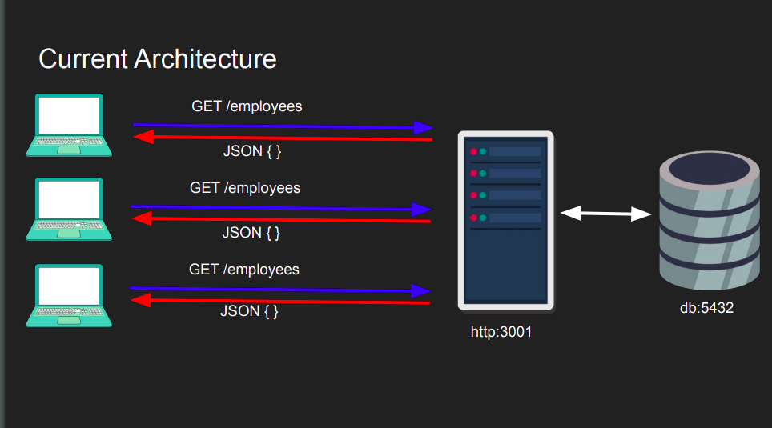
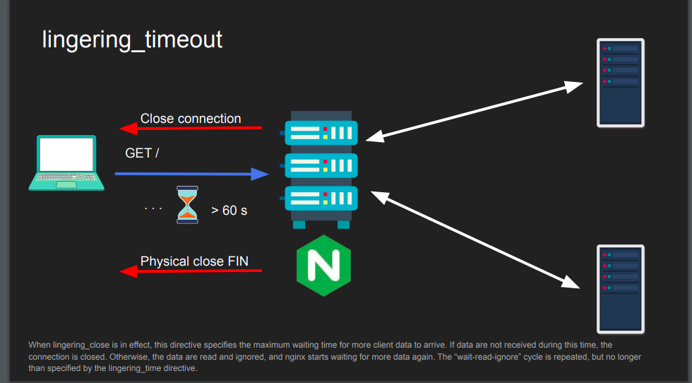

# NGINX Notes

**NGINX is written in C.**

## What is NGINX?
NGINX is a high-performance web server that serves web content. It is also widely used as a reverse proxy, which means it can be utilized for various purposes, including:

- **Load Balancing**
  - Distributes incoming network traffic across multiple backend servers to ensure no single server becomes overwhelmed, improving overall application reliability.
- **Backend Routing**
  - Example: If you navigate to `/app`, NGINX can route you to `/v1` on the backend.
  - Example: If you go to `/team`, NGINX can route you to `/v2` on the backend.
- **Caching**
  - When client A makes a request, NGINX forwards it to the backend server and caches the response.
  - If client B makes the same request, NGINX can serve the cached response directly, reducing load on the backend and improving response times.
- **API Gateway**
  - Acts as a single entry point for APIs, managing API traffic, routing requests, and handling common concerns such as authentication, rate limiting, and more.

## NGINX Layer 4 vs Layer 7 Proxying

Layer 4 and Layer 7 refer to layers in the OSI model:

### Layer 4 Proxying (Transport Layer)
- At Layer 4, the focus is on the transport layer, specifically TCP/UDP.
- Information accessible at Layer 4 includes:
  - **Source IP, Source Port:** Identifies the origin of the packet. (note: source ip belongs to browser aka client)
  - **Destination IP, Destination Port:** Identifies the target of the packet. (note: destination ip belongs to nginx server)
  - **Simple packet inspection:** Limited to things like SYN packets or TLS Hello messages.
- **Use Case:** Useful when NGINX needs to proxy protocols it doesn't natively understand (e.g., MySQL protocol). In such cases, NGINX forwards the raw TCP/UDP traffic without analyzing the contents.

### Layer 7 Proxying (Application Layer)
- At Layer 7, NGINX operates at the application layer, handling protocols like HTTP, HTTPS, and gRPC.
- Information accessible at Layer 7 includes:
  - **Full understanding of the application protocol:** NGINX knows which URLs or resources are being accessed.
  - **Ability to modify content:** Since NGINX understands the protocol, it can modify headers, apply caching, and perform other content-aware actions.
  - **Decryption required:** If traffic is encrypted (e.g., HTTPS), NGINX must decrypt it to perform Layer 7 processing.
- **Use Case:** Ideal for scenarios where NGINX needs to manage connections, cache responses, or apply specific application logic based on the request content.

### Using Stream Context for Layer 4 Proxying
- NGINX uses the `stream` context to configure Layer 4 proxying.
- This is particularly useful for protocols outside of HTTP, where NGINX does not need to understand the specific application protocol, but only forwards raw TCP/UDP traffic.

By using either Layer 4 or Layer 7 proxying, NGINX can handle a wide range of traffic management scenarios, from simple load balancing to complex application delivery configurations.


## Current vs Desired Architecture





# TLS and NGINX

## TLS (Transport Layer Security)
- TLS stands for **Transport Layer Security**.
- It is a protocol used to establish end-to-end encryption between two parties (typically a client and a server).
- In TLS, **symmetric encryption** is used for communication, meaning both the client and the server share the same encryption key.
- **Asymmetric encryption** is used initially to exchange the symmetric key securely, often using a method like Diffie-Hellman.
- The server (and sometimes the client) needs to authenticate itself by providing a certificate signed by a trusted Certificate Authority (CA).

## TLS Termination
- **TLS termination** occurs when NGINX handles incoming TLS (e.g., HTTPS) connections from clients, decrypts the traffic, and then forwards the decrypted data to the backend server over plain HTTP.
- Example: NGINX handles HTTPS traffic, but the backend only supports HTTP.
- The process:
  - NGINX receives the client’s encrypted request.
  - NGINX decrypts the request and forwards the plain data to the backend.
  - If the backend also supports HTTPS (TLS), NGINX can decrypt, optionally modify the content, and then re-encrypt it before sending it to the backend.
- **Best Practice**: It is recommended in the industry to have TLS between the client and NGINX as well as between NGINX and the backend server to maintain a secure, encrypted connection throughout.

## TLS Pass-Through
- **TLS pass-through** is used when you don't want NGINX to terminate (decrypt) the TLS connection.
- In this case, the backend server must support TLS (i.e., the backend must be able to handle HTTPS connections).
- NGINX acts as a conduit, simply forwarding encrypted packets directly to the backend server without decrypting them.
- The entire TLS handshake is forwarded from the client to the backend, similar to a tunnel.
- **Considerations**:
  - With TLS pass-through, NGINX cannot cache content or perform Layer 7 (L7) checks because it doesn’t decrypt the traffic.
  - However, this approach is more secure because NGINX doesn’t need access to the backend's TLS certificates.


## NGINX Internal Architecture


# Serving Simple HTML with NGINX and Docker

## Running NGINX with Docker

\```sh
docker run --name nginx -p 80:80 --hostname <hostname> -v <your local html>:/usr/share/nginx/html nginx
\```

## What is --hostname in Linux and Docker?
### Hostname in Linux
* The hostname is the name of a computer or device on a network.
* It is used to identify the machine in network communications.
* You can view or change the hostname using the `hostname` command in Linux.

### Hostname in Docker
* In Docker, the `--hostname` flag is used to set the hostname for the Docker container.
* This hostname is used internally by the container and can be useful for network identification within Docker environments.
* The container’s hostname is independent of the host machine’s hostname unless explicitly set.

## Difference Between Hostname and Username
### Hostname:
* A hostname identifies a device on a network.
* It's related to networking and helps in routing data to the correct machine.

### Username:
* A username is a credential used to identify a user on a system.
* It is related to user accounts and is used for login and access control.

### How IP Address is Related to Hostname in Docker
* In Docker, a container's hostname can be mapped to an IP address.
* Docker automatically assigns an IP address to each container within its network.
* The hostname can be used within the Docker network to refer to the container by name instead of by IP address.

## Creating Two Node.js Servers to Display Hostname
You can create two Node.js servers that display the hostname using the os library.

```js
// app.js
const http = require('http');
const os = require('os');

const hostname = os.hostname();
const port = 3000;

const server = http.createServer((req, res) => {
  res.statusCode = 200;
  res.setHeader('Content-Type', 'text/plain');
  res.end(`Hostname: ${hostname}\n`);
});

server.listen(port, () => {
  console.log(`Server running at http://${hostname}:${port}/`);
});
```

## Dockerfile

```yaml
FROM node:12
WORKDIR /home/node/app
COPY ./ /home/node/app
RUN npm install
CMD node app.js
```

## Example NGINX Configuration (nginx.conf)

```nginx
worker_processes 1; # This is a key-value pair known as directives or you can think of it as variable declarations.

events { # The 'events' block is a context.
    worker_connections 1024; # Inside a context, you can have directives.
}

http { # 'http' and 'server' are built-in contexts utilized by NGINX to start servers.
    server { # We can have as many servers as we want; each server will be created by NGINX.
        listen 8080;
        root /usr/share/nginx/html; # This path should contain index.html.
    }
}

events {}
```


## MIME Types

create `index.html` and `style.css`

Now this style or CSS won't be displayed in Chrome. In the Chrome Inspect Network tab, in the response header, `Content-Type` is `text/plain` for `style.css`. This is because by default, NGINX treats it as a simple text file.

### To solve this:

Inside `nginx.conf` file:

```nginx
http {
    types {
        text/css    css; # If the file has a .css extension, then treat its content type as text/css
        text/html   html;
    }
    server {}
}
```

### Instead of specifying each extension type manually, use a shortcut:

```nginx
http {
    include mime.types; # This will include everything in the mime.types context
    server {}
}
```


## Location Block
Example Setup:
Create fruits/index.html.
Create vegetables/veggies.html.

### nginx.conf Example:


```nginx
http {
    server {
        listen 8080;
        root /usr/share/nginx/html;

        location /fruits {
            root /usr/share/nginx/html; 
            # If anyone comes to /fruits, we will serve /fruits/index.html.
            # Notice we are not adding /fruits here because by default it will be appended.
            # The final root path will look like this: /usr/share/nginx/html/fruits
        }

        location /carbs {
            alias /usr/share/nginx/html/fruits; 
            # Alias won't append /carbs to the end of this path
        }

        # Anytime we use root inside a location, we must make sure that the folder is present

        location /vegetables {
            root /usr/share/nginx/html/app; 
            # By default, it will look for index.html inside the vegetables folder.
            # If it can't find it, it will throw a 403 error. To solve this:
            try_files /vegetables/veggies.html /index.html =404; 
            # We tell NGINX to look for the veggies file. If it's not present, then display index.html in the root folder (/html).
            # If that is not present either, then display a 404 error.
        }

        location ~* /count/[0-9] { # regex
            root /usr/share/nginx/html/;
            try_files /index.html =404;
        }

        location /crops {
            return 307 /fruits; 
            # 307 is the HTTP code for redirecting to /fruits.
            # The page will load, meaning it will go to the /fruits page, so the URL you see will be /fruits.
        }

        rewrite ^/number/(\w+) /count/$1; 
        # Here, the page won't reload, and you will see /number/<word> itself.

        # What is the difference between rewrite and redirect?
    }
}
```


## load balancer 

create simple express app
start 3 containers using that app

```nginx
http {
    upstream backendserver {
        server node1:8080;
        server node2:8080;
        server node3:8080;
    }
    server {
        listen 8080;
        location / {
            proxy_pass http://backendserver/;
        }
    }
}
```


### task-1
create 2 nginx server with 2 differnet exported port 80 and 81 and create 2 nodejs app both of this nginx server should connect both of the node app
so i can vist http://localhost:80 and http://localhost:81 


### task-2
    try spining up 10 nodejs container, nodeapp1 to nodeapp10 , and have two nginx containers nginx1 load balance nodeapp1 to nodeapp5 and nginx2 load balance nodeapp6 to nodeapp10


# NGINX Frontend Timeouts

### What are Frontend Timeouts in NGINX?
Frontend timeouts in NGINX refer to the time limits set for communication between the client and NGINX. In this context:

- **Client**: The client is the entity (usually a browser, mobile app, or another service) making HTTP requests to the NGINX server.
- **Request**: The request is the HTTP request made by the client to NGINX, which includes headers, the body, and any additional data.
- **Communication**: This is the interaction between the client and NGINX. Frontend timeouts define how long NGINX will wait for certain actions to complete during this interaction.

### Types of Frontend Timeouts

#### 1. `client_header_timeout`
- **Definition**: This timeout defines how long NGINX will wait to receive the full client request header.
- **How It Works**: The request header is the first part of the HTTP request that includes metadata like the method (GET, POST), content type, and more. If the client does not send the complete request header within the specified time, NGINX will terminate the request with a 408 (Request Timeout) error. This means NGINX expects the client to send all necessary header information within this time frame.
- **Example**: Imagine you're filling out a form online, and the website (acting as the client) sends the form's structure to the server (NGINX) as a header. If it takes too long to send this structure, the server will assume something is wrong and stop waiting.
- **Default Value**: The default `client_header_timeout` is 60 seconds.         

#### 2. `client_body_timeout`
- **Definition**: This timeout defines how long NGINX will wait to receive the client request body.
- **How It Works**: The request body contains the actual data being sent (e.g., the content of a form). The `client_body_timeout` is set for the time between two successive read operations, not for the entire transmission of the request body. If the client doesn't send any data within this period, the request is terminated with a 408 (Request Timeout) error.
- **Example**: After sending the header, the client starts sending the data (e.g., the text you typed into the form). If it takes too long between sending chunks of this data, the server will stop waiting. For example, the first two chunks of data must be sent within 60 seconds. Once NGINX receives these, the timeout resets, and the next two chunks must also be sent within 60 seconds, and so on.
- **Default Value**: The default `client_body_timeout` is 60 seconds.       


#### 3. `send_timeout`
- **Definition**: This timeout specifies how long NGINX will wait while sending a response to the client.
- **How It Works**: Once NGINX starts sending a response back to the client, it expects the client to acknowledge the data being sent. If the client doesn't acknowledge the data within the `send_timeout` period, NGINX will close the connection. This timeout is only for the period between two write operations to the client.
- **Example**: Imagine you're downloading a file, and the server (NGINX) is sending it to you in chunks. If your browser (the client) doesn't acknowledge the receipt of these chunks within the set time, the server will stop sending the file.
- **Default Value**: The default `send_timeout` can vary, but it typically is set to a few seconds or minutes depending on the server's configuration.            

#### 4. `keepalive_timeout`
- **Definition**: This timeout specifies the amount of time NGINX will keep a connection open after completing a request, waiting for another request from the same client.
- **How It Works**: After NGINX has sent the response, it will keep the connection open for a specified time, allowing the client to make additional requests without establishing a new connection. If the client doesn't make another request within the `keepalive_timeout` period, NGINX will close the connection.
- **Example**: Think of this as a phone call where, after finishing one conversation, you stay on the line for a while in case the other person wants to say something else. If they don't speak up within a certain amount of time, you hang up.
- **Default Value**: The default `keepalive_timeout` is usually 75 seconds.         

#### 5. `lingering_timeout`
- **Definition**: This timeout is used to keep the connection open for a brief period after the response has been sent, allowing the client to receive any remaining data.
- **How It Works**: After NGINX has finished sending the response, it will wait for a short time to ensure that all data has been successfully sent and received by the client. If there is any data left to send, NGINX will send it; otherwise, it will close the connection.
- **Example**: Imagine you’re sending a package, and after it leaves your hands, you wait for a moment to make sure it’s securely in the recipient's hands before walking away.
- **Default Value**: The default `lingering_timeout` is typically a few seconds.            

#### 6. `resolver_timeout`
- **Definition**: This timeout defines how long NGINX will wait for a DNS resolution request to complete.
- **How It Works**: When NGINX needs to resolve a domain name into an IP address (e.g., when proxying a request to another server), it will wait for the DNS server to respond. If the DNS resolution doesn’t complete within the specified time, NGINX will terminate the request with a DNS resolution error.
- **Example**: This is like waiting for someone to give you directions. If they take too long to respond, you might decide to give up and find another way.
- **Default Value**: The default `resolver_timeout` is usually 30 seconds.          


# NGINX Backend Timeouts

Backend timeouts in NGINX refer to the time limits set for communication between NGINX (acting as a reverse proxy) and the backend server (e.g., an application server or database). These timeouts determine how long NGINX will wait for various actions to complete when interacting with the backend server.

### Types of Backend Timeouts

#### 1. `proxy_connect_timeout`
- **Definition**: This timeout defines how long NGINX will wait to establish a connection with the backend server.
- **How It Works**: When NGINX forwards a request to a backend server, it first needs to establish a connection. The `proxy_connect_timeout` specifies how long NGINX will wait for this connection to be established. If the connection cannot be established within this time, NGINX will terminate the request and possibly try another server in the upstream group.
- **Example**: Imagine NGINX is trying to call a backend service (like a phone call). If the backend server takes too long to pick up, NGINX will hang up and potentially try another number (another server).
- **Default Value**: The default value is usually set to 60 seconds but can be adjusted based on the network environment.           


#### 2. `proxy_send_timeout`
- **Definition**: This timeout defines how long NGINX will wait to send the request to the backend server after the connection has been established.
- **How It Works**: Once the connection to the backend server is established, NGINX begins to send the client's request. The `proxy_send_timeout` specifies how long NGINX will wait to complete sending this request. If the backend server doesn’t receive the full request within this time, NGINX will terminate the connection.
- **Example**: After dialing a number and the call connects, if it takes too long to communicate your message, you might hang up and try again later. This is similar to how NGINX handles sending requests.
- **Default Value**: The default value can vary but is often set to 60 seconds.         

#### 3. `proxy_read_timeout`
- **Definition**: This timeout defines how long NGINX will wait to receive a response from the backend server after sending the request.
- **How It Works**: After NGINX has sent the request to the backend server, it waits for the server to respond. The `proxy_read_timeout` specifies how long NGINX will wait for this response. If the backend server doesn’t send a complete response within this time, NGINX will close the connection.
- **Example**: This is like waiting for someone to respond after you've asked them a question. If they take too long, you might decide to stop waiting and move on.
- **Default Value**: The default value is typically set to 60 seconds.          

#### 4. `proxy_next_upstream_timeout`
- **Definition**: This timeout defines the maximum time NGINX will spend trying to forward a request to the next server in the upstream group if the current server fails.
- **How It Works**: If a request to a backend server fails (e.g., the server is down or unreachable), NGINX can try to send the request to another server in the upstream group. The `proxy_next_upstream_timeout` sets a limit on how long NGINX will keep trying to connect to these servers before giving up.
- **Example**: Imagine you're calling a series of phone numbers in a list. If one number doesn't answer, you move on to the next. But after trying for too long, you might decide to stop trying altogether.
- **Default Value**: This is typically set to a few minutes but can be configured based on the desired fault tolerance.             

#### 5. `keepalive_timeout` (Backend)
- **Definition**: This timeout specifies how long NGINX will keep the connection to the backend server open after sending a request and receiving a response, waiting for another request.
- **How It Works**: After NGINX receives a response from the backend server, it can keep the connection open in case there are additional requests. The `keepalive_timeout` sets the duration for how long this connection should remain open. Keeping connections alive reduces the overhead of establishing new connections for each request.
- **Example**: Think of this as leaving a phone line open after one conversation, so you don’t have to redial if you need to talk again shortly after.
- **Default Value**: The default `keepalive_timeout` for the backend is usually 60 seconds.         


# NGINX as a Layer 7 Proxy

### What is Layer 7 Proxying?
Layer 7 proxying operates at the application layer of the OSI model, allowing NGINX to manage and route traffic based on application-specific data, such as URLs, headers, and cookies. This enables NGINX to make intelligent decisions about how to handle, route, and secure web traffic.

### NGINX as a Layer 7 Proxy
NGINX can function as a Layer 7 proxy, primarily for HTTP/HTTPS traffic. This allows it to inspect, route, and modify requests and responses based on detailed application-layer data.

#### Key Features of NGINX as a Layer 7 Proxy:

1. **SSL/TLS Termination**:
   - **Explanation**: SSL/TLS termination is when NGINX decrypts incoming encrypted connections (such as HTTPS) before forwarding the request to the backend servers. This offloads the SSL/TLS processing workload from the backend servers, allowing them to focus on serving content.
   - **Benefit**: It simplifies the management of SSL certificates and reduces the computational overhead on backend servers, making the entire system more efficient.

2. **Load Balancing**:
   - **Explanation**: NGINX can distribute incoming requests across multiple backend servers. It can balance the load using various algorithms, such as round-robin, least connections, or IP hash, ensuring no single server becomes overwhelmed.
   - **Benefit**: Improves the scalability and reliability of your application by evenly distributing traffic, reducing the risk of server overload.

3. **Static Content Delivery**:
   - **Explanation**: NGINX can serve static files like images, CSS, and JavaScript directly from the file system without involving backend servers. This reduces the load on the backend and speeds up content delivery to users.
   - **Benefit**: Enhances performance by reducing latency and server load, ensuring faster delivery of static assets.

4. **Application-Aware Routing**:
   - **Explanation**: NGINX can route requests based on specific application-layer data. For example, it can route requests differently depending on the User-Agent header, sending mobile users to a different backend than desktop users.
   - **Benefit**: Provides flexibility to serve different content or handle requests differently based on the context, improving user experience and resource utilization.

### Example NGINX Configuration as a Layer 7 Proxy:

```nginx
server {
    listen 80;
    server_name example.com;

    # SSL/TLS termination
    listen 443 ssl;
    ssl_certificate /path/to/cert.pem;
    ssl_certificate_key /path/to/key.pem;

    # Load balancing requests to the /api/ endpoint
    location /api/ {
        proxy_pass http://backend-api;
        proxy_set_header Host $host;
        proxy_set_header X-Real-IP $remote_addr;
        proxy_set_header X-Forwarded-For $proxy_add_x_forwarded_for;
        proxy_set_header X-Forwarded-Proto $scheme;
    }

    # Serving static content directly
    location /static/ {
        root /var/www/html;
    }

    # Application-aware routing example
    location /app/ {
        if ($http_user_agent ~* "Mobile") {
            proxy_pass http://mobile-backend;
        }
        proxy_pass http://desktop-backend;
    }
}
```


## Detailed Explanation:
### SSL/TLS Termination:

NGINX handles the secure connection on behalf of the backend servers by terminating SSL/TLS. This means it decrypts incoming HTTPS traffic before forwarding it to the backend servers over HTTP or a secure connection. This process offloads the CPU-intensive task of encryption/decryption from the backend servers, improving overall performance.
### Load Balancing:

Requests to the /api/ endpoint are routed to a group of backend servers using load balancing. NGINX can distribute traffic based on different algorithms, ensuring that no single server becomes a bottleneck. This makes your application more scalable and resilient.
### Static Content Delivery:

NGINX serves static files, such as images or CSS, directly from the specified directory (/var/www/html). This bypasses the backend servers entirely for these requests, reducing their load and speeding up content delivery to the user.
### Application-Aware Routing:

NGINX can route requests based on the content of the request, such as the User-Agent header. For example, mobile users might be routed to a specific backend optimized for mobile traffic, while desktop users are routed to a different backend. This enables tailored responses and better user experience.
Benefits of Using NGINX as a Layer 7 Proxy:
### Efficiency:

Offloads work from backend servers by handling SSL/TLS termination, caching, and static content delivery directly. This reduces the computational load on the backend, allowing it to serve dynamic content more efficiently.
### Flexibility:

Enables complex routing and load balancing decisions based on application-layer data, such as request headers, cookies, and URL patterns. This allows for more sophisticated and responsive traffic management.
### Security:

Enhances security by inspecting and controlling application-level traffic. NGINX can enforce security policies, filter malicious requests, and ensure that only legitimate traffic reaches the backend servers.
### Scalability:

By distributing traffic across multiple backend servers and caching frequently requested content, NGINX helps scale applications to handle more users without degrading performance.


# IP Hash in NGINX

### What is IP Hash?
`ip_hash` is a load balancing method in NGINX that distributes incoming client requests based on the client's IP address. This method ensures that requests from the same client (with the same IP address) are consistently routed to the same backend server.

### How IP Hash Works:
- NGINX calculates a hash based on the client’s IP address.
- This hash is used to determine which backend server in the upstream group the request should be forwarded to.
- Because the hash is consistently calculated for the same IP address, all requests from a particular client will go to the same backend server, unless that server is unavailable.

### Benefits of IP Hash:
1. **Session Persistence**:
   - IP Hash provides a basic form of session persistence (also known as "sticky sessions"). This is useful for applications where maintaining a consistent connection to the same backend server is important, such as shopping carts or user sessions.

2. **Load Distribution**:
   - While not as evenly distributed as round-robin, IP Hash can still balance the load across servers, especially when clients have a wide range of IP addresses.

3. **Simplicity**:
   - IP Hash is simple to configure and doesn’t require additional configuration or third-party modules for basic session persistence.

### Example Configuration:

```nginx
http {
    upstream backend_servers {
        ip_hash;
        server backend1.example.com;
        server backend2.example.com;
        server backend3.example.com;
    }

    server {
        listen 80;
        server_name example.com;

        location / {
            proxy_pass http://backend_servers;
        }
    }
}
```


# Most Commonly Used NGINX Built-In Variables

## Request and Connection Variables

### `$request_method`
- **Description**: Represents the HTTP request method (e.g., GET, POST).
- **Usage**: Useful for conditional processing based on the type of HTTP request.
- **Example**: `GET`, `POST`

### `$request_uri`
- **Description**: The full URI requested by the client, including the query string.
- **Usage**: Useful for logging or redirecting based on the full request URI.
- **Example**: `/index.html?search=nginx`

### `$remote_addr`
- **Description**: The IP address of the client making the request.
- **Usage**: Commonly used for logging client IPs or applying access control rules.
- **Example**: `192.168.1.1`

### `$server_name`
- **Description**: The server name that matches the request.
- **Usage**: Useful for virtual hosting and serving different content based on the server name.
- **Example**: `www.example.com`

### `$status`
- **Description**: The response status code sent to the client (e.g., 200, 404).
- **Usage**: Useful for logging and monitoring response status codes.
- **Example**: `200`, `404`

## Location and File Handling Variables

### `$uri`
- **Description**: The normalized request URI without the query string.
- **Usage**: Useful for rewriting and proxying requests based on the URI.
- **Example**: `/index.html`

### `$document_root`
- **Description**: The root directory of the request. Typically used to resolve file paths.
- **Usage**: Useful for serving static files or specifying the base directory for requests.
- **Example**: `/var/www/html`

### `$query_string`
- **Description**: The query string part of the request URI.
- **Usage**: Useful for processing or passing query parameters in the application.
- **Example**: `search=nginx`

## Response Variables

### `$body_bytes_sent`
- **Description**: The number of bytes sent to the client, excluding headers.
- **Usage**: Useful for monitoring the amount of data transferred in responses.
- **Example**: `1024`

### `$http_user_agent`
- **Description**: The User-Agent header from the request, identifying the client browser or device.
- **Usage**: Useful for logging user agents or customizing responses based on client software.
- **Example**: `Mozilla/5.0 (Windows NT 10.0; Win64; x64) AppleWebKit/537.36 (KHTML, like Gecko) Chrome/58.0.3029.110 Safari/537.3`

## Example Configuration

Here's a sample configuration snippet demonstrating the use of some of these variables:

```nginx
server {
    listen 80;
    server_name www.example.com;

    location / {
        root /var/www/html;
        index index.html;

        # Log the request method and URI
        access_log /var/log/nginx/access.log combined;

        # Redirect requests based on the User-Agent
        if ($http_user_agent ~* "Googlebot") {
            return 403;
        }
    }
}
```


# NGINX Load Balancing Methods with Real-World Examples

NGINX can balance traffic across multiple servers using various methods. Here’s how each method can be applied in real-world scenarios, including their usage:

## 1. Round Robin

- **Description**: Distributes requests sequentially across all available backend servers.
- **Usage**: This is the default method and is used when you want an even distribution of requests across all servers.
- **Real-World Example**: Imagine you have a web application with three backend servers handling user requests. Round Robin ensures that each server gets an equal number of requests over time.

- **Configuration**:
    ```nginx
    upstream backend {
        server app-server1.example.com;
        server app-server2.example.com;
        server app-server3.example.com;
    }

    server {
        listen 80;

        location / {
            proxy_pass http://backend;
        }
    }
    ```

## 2. Least Connections

- **Description**: Routes requests to the server with the fewest active connections. This helps to balance the load more evenly based on current server usage.
- **Usage**: Ideal when backend servers have different capacities and the goal is to avoid overloading any single server.
- **Real-World Example**: If you have backend servers with varying performance capabilities, Least Connections ensures that the server with the least number of active connections handles the next request.

- **Configuration**:
    ```nginx
    upstream backend {
        least_conn;
        server app-server1.example.com;
        server app-server2.example.com;
        server app-server3.example.com;
    }

    server {
        listen 80;

        location / {
            proxy_pass http://backend;
        }
    }
    ```

## 3. IP Hash

- **Description**: Routes requests based on the client’s IP address, ensuring that requests from the same IP address are consistently directed to the same backend server.
- **Usage**: Useful for applications requiring session persistence (sticky sessions) where users need to interact with the same server to maintain session state.
- **Real-World Example**: In an online shopping cart system, IP Hash ensures that a user’s shopping cart is always managed by the same server, preserving their session data.

- **Configuration**:
    ```nginx
    upstream backend {
        ip_hash;
        server app-server1.example.com;
        server app-server2.example.com;
        server app-server3.example.com;
    }

    server {
        listen 80;

        location / {
            proxy_pass http://backend;
        }
    }
    ```

## 4. Generic Hash

- **Description**: Distributes requests based on a hash of a specified parameter (e.g., URI, header), which ensures that requests with the same parameter value are directed to the same server.
- **Usage**: Useful when you want to consistently route requests based on specific attributes of the request, such as URL paths or headers.
- **Real-World Example**: If your application handles different types of content (e.g., `/api`, `/images`), Generic Hash can ensure that all `/api` requests are routed to the same set of servers, while `/images` requests go to another set.

- **Configuration**:
    ```nginx
    upstream backend {
        hash $request_uri;
        server app-server1.example.com;
        server app-server2.example.com;
        server app-server3.example.com;
    }

    server {
        listen 80;

        location / {
            proxy_pass http://backend;
        }
    }
    ```

## 5. Fair (Requires Third-Party Module)

- **Description**: Uses the `ngx_http_fair_module` to balance requests based on server performance and load. This module is not included by default and must be compiled separately.
- **Usage**: Suitable for environments where you need a more sophisticated load balancing approach that considers each server's current load.
- **Real-World Example**: For a SaaS application with servers in different regions and with varying capacities, Fair ensures that requests are distributed based on each server's performance, preventing any server from being overwhelmed.

- **Configuration**:
    ```nginx
    upstream backend {
        fair;
        server app-server1.example.com;
        server app-server2.example.com;
        server app-server3.example.com;
    }

    server {
        listen 80;

        location / {
            proxy_pass http://backend;
        }
    }
    ```

These methods allow you to tailor the load balancing strategy to fit the specific needs of your application, improving performance, reliability, and user experience.


## using ssl certificate to enable only tls 1.2 

#### run your nginx server in port 80 and login to your router add port forwarding for 80 and 443 port to your local machine 
#### go noip.com paste your public ip and create new hostname to get your domain and url using this you can access your local content from anywhere


#### install letsencrypt in your local machine

#### to get publick key and private key
```sh
sudo certbot certonly --standalone
# ask you to enter you domain (paste what you got from noip.com)
```

copy the public key and private key path

vim nginx.conf
```nginx
server {
    listen 80;
    listen 443 ssl;

    ssl_certificate <public key path>;
    ssl_certificate <private key path>;
}
```

visit cdn77.com paste your url it will show tls 1.3 is not enabled 


#### in the same server enabling tls 1.3

```nginx
server {
    listen 80;
    listen 443 ssl;

    ssl_certificate <public key path>;
    ssl_certificate <private key path>;
    ssl_protocols TLSv1.3; # important
}
```


# Extra


# How a TLS Certificate Works

A TLS (Transport Layer Security) certificate, also known as an SSL (Secure Sockets Layer) certificate, is used to establish a secure, encrypted connection between a web server and a client (usually a web browser). Here’s a simplified explanation of how it works:

## Key Concepts

1. **Encryption**: Converts data into a code to prevent unauthorized access.
2. **Decryption**: Converts the code back into readable data.
3. **Public Key**: Used to encrypt data. It is shared openly.
4. **Private Key**: Used to decrypt data. It is kept secret by the certificate owner.
5. **Certificate Authority (CA)**: A trusted entity that issues certificates.

## How TLS Certificates Work

### 1. **Request and Issuance**

1. **Generating a Key Pair**:
   - The website owner generates a public-private key pair.
   - The public key is shared openly, while the private key is kept secure.

2. **Creating a Certificate Signing Request (CSR)**:
   - The website owner creates a CSR containing the public key and other information (e.g., domain name, organization details).

3. **Submitting CSR to CA**:
   - The CSR is sent to a Certificate Authority (CA), which verifies the information.

4. **Issuing the Certificate**:
   - Once verified, the CA signs the certificate with its private key and issues it to the website owner.
   - The certificate contains the website's public key and CA's digital signature.

### 2. **Establishing a Secure Connection**

1. **Client Connects to Server**:
   - When a client (browser) connects to a server using HTTPS, the server presents its TLS certificate.

2. **Certificate Validation**:
   - The client verifies the certificate by checking the CA’s digital signature and the certificate’s validity period.
   - The client ensures the certificate matches the server’s domain name.

3. **Encryption Setup**:
   - The client and server perform a handshake to establish encryption parameters.
   - They use the server’s public key to exchange a session key securely.

4. **Secure Data Transmission**:
   - Both client and server use the session key to encrypt and decrypt data transmitted between them.
   - This ensures that even if someone intercepts the data, it cannot be read without the session key.

### 3. **Ongoing Security**

1. **Session Resumption**:
   - For efficiency, the client and server may use session resumption to avoid repeating the handshake process in subsequent connections.

2. **Certificate Renewal**:
   - Certificates have expiration dates. Website owners must renew and replace their certificates periodically to maintain security.

## Example Scenario

1. **User Visits Website**:
   - A user enters `https://example.com` in their browser.

2. **TLS Handshake**:
   - The browser connects to the web server and receives the server’s TLS certificate.
   - The browser verifies the certificate with the CA and checks the domain name.

3. **Secure Connection**:
   - After validation, the browser and server exchange encryption keys.
   - Data between the browser and server is encrypted using these keys.

4. **Data Encryption**:
   - All data sent from the browser to the server and vice versa is encrypted, ensuring secure communication.

By using TLS certificates, websites can protect sensitive information, such as login credentials and payment details, from being intercepted and misused.


# Difference Between HTTP and HTTP/2

HTTP (Hypertext Transfer Protocol) and HTTP/2 are protocols used for transferring data over the web. HTTP/2 is an improved version of HTTP/1.1, offering various enhancements to performance and efficiency.

## Key Differences

### 1. **Protocol Version**

- **HTTP/1.1**:
  - The version of HTTP used by most web applications before HTTP/2.
  - It operates over a single connection and uses text-based headers.

- **HTTP/2**:
  - The second major version of HTTP, introduced to improve performance and efficiency.
  - It operates over a single, multiplexed connection and uses binary framing.

### 2. **Connection Multiplexing**

- **HTTP/1.1**:
  - Uses a single connection for each request-response pair.
  - Multiple requests often lead to multiple connections or require the use of pipelining, which can cause head-of-line blocking (HOLB).

- **HTTP/2**:
  - Allows multiple requests and responses to be sent concurrently over a single connection.
  - Uses multiplexing to handle multiple streams simultaneously without blocking.

### 3. **Header Compression**

- **HTTP/1.1**:
  - Sends headers as plain text with each request and response.
  - Headers can be repetitive and increase overhead.

- **HTTP/2**:
  - Uses HPACK compression to compress headers, reducing redundancy and improving efficiency.
  - Reduces the amount of data sent over the network.

### 4. **Binary Protocol**

- **HTTP/1.1**:
  - Text-based protocol with human-readable headers and messages.
  - Parsing and processing are performed on text-based data.

- **HTTP/2**:
  - Binary protocol with a binary framing layer.
  - More efficient in parsing and processing due to binary encoding.

### 5. **Server Push**

- **HTTP/1.1**:
  - No built-in mechanism for server push.
  - The client must request resources individually.

- **HTTP/2**:
  - Supports server push, allowing the server to send resources to the client before the client requests them.
  - Can reduce latency by preemptively sending resources.

### 6. **Stream Prioritization**

- **HTTP/1.1**:
  - No built-in mechanism for prioritizing resources.
  - Requests are handled in the order they are received.

- **HTTP/2**:
  - Supports stream prioritization, allowing clients to specify the priority of streams.
  - Improves performance by allowing more important resources to be delivered first.

## Example Comparison

### HTTP/1.1 Request:

```http
GET /index.html HTTP/1.1
Host: example.com
```


## example config 


In this configuration:

- `server_tokens off;`: Hides the NGINX version number in HTTP response headers to prevent revealing server details.
- `add_header Cache-Control "no-cache, no-store";`: Prevents caching of the response by the client and intermediate proxies.
- `add_header Pragma "no-cache";`: Another header to ensure the response is not cached.
- `add_header X-XSS-Protection "1; mode=block";`: Enables the browser's XSS (Cross-Site Scripting) protection and blocks the page if an attack is detected.
- `add_header X-Frame-Options "SAMEORIGIN";`: Prevents the page from being framed by other sites, mitigating clickjacking attacks.
- `add_header Strict-Transport-Security "max-age=63072000; includeSubDomains";`: Enforces HTTPS and includes all subdomains for a specified duration (2 years in this case).
- `listen [::]:80;`: Configures the server to listen on port 80 for HTTP requests over IPv6.

You can copy and paste this Markdown code directly into your `.md` file to retain the code formatting.


