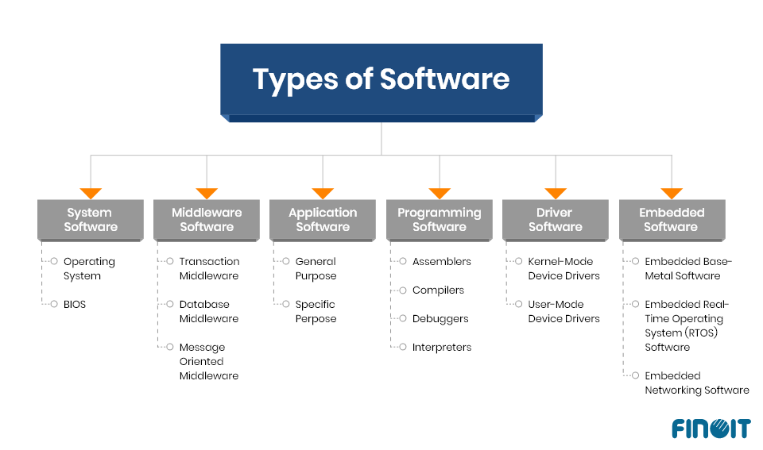
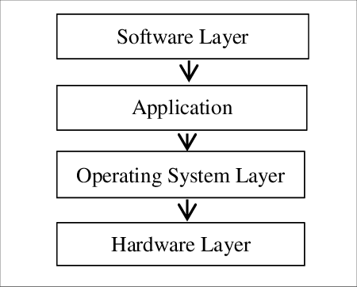
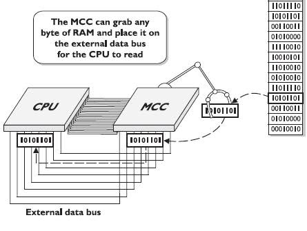
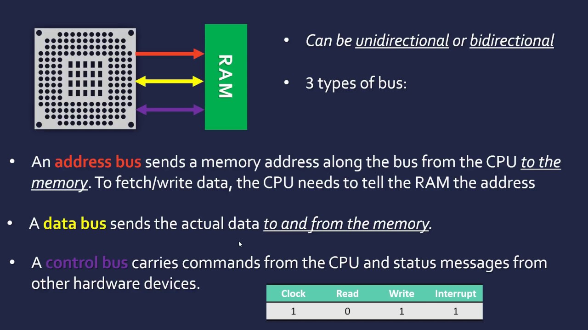
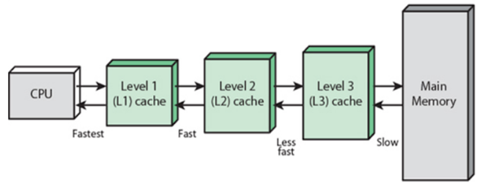
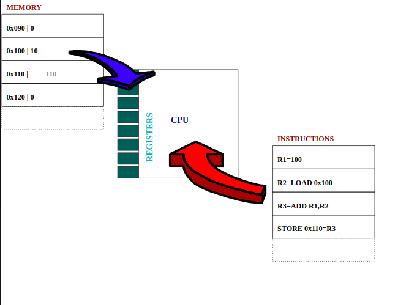

# Computer Basics

## Input, Process, Output, Storage (IPOS)

- Example: If `5 + 6` is an input, the computer processes it and produces the output `11`.

### Definition
A computer is an electronic device that performs mathematical and non-mathematical operations with the help of instructions to process information to achieve desired results.

### Key Figures
- **Charles Babbage**: Father of Computers
- **Alan Turing**: Father of Computer Science and AI

### Function
A computer turns data into information, making our lives better, more enjoyable, and more connected.

## Primary Operations: IPOSc
- **C** stands for Communication.

### Function
- Transform data into information.

## Size Categories
- Handheld
- Embedded
- Personal
- Desktop
- Server
- Mainframe
- Supercomputer

## Components
- **Hardware**: IPOS (Input, Process, Output, Storage)
- **Software**: Application and System Software

## Software

### System Software
- **Operating System (OS)**: Performs basic tasks such as recognizing input from the keyboard, sending output to the display screen, keeping track of files and directories on the hard disk, and controlling peripheral devices like printers and modems.
- **Utilities**: Perform day-to-day tasks related to the maintenance of the computer system (e.g., backup, data recovery, virus protection, disk management).
- **Translators**: Translate high-level language programs into machine language, which the computer understands.
- **Drivers**: Device drivers are system programs responsible for the proper functioning of devices.

### Application Software
- Any software used by users (e.g., MS Office, Chrome, Visual Studio Code).

## Computer Evolution

### Five Generations of Computers
1. Vacuum Tubes
2. Transistors
3. Integrated Circuits/Chips
4. CPUs (Microprocessors)
5. Artificial Intelligence and Quantum Computing (?)

## Moore's Law
- Predicts that the number of transistors on a microchip doubles approximately every two years, leading to the exponential increase in computing power.

## Information Technology (IT)
- The use of digital technology, like computers and the internet, to store and process data into useful information.
- IT helps solve meaningful problems in various industries such as education, medicine, journalism, construction, transportation, entertainment, and more.

## History of Computing
- From the abacus to the analytical engine.
- **Computer**: A device that stores and processes data by performing calculations.
- **Algorithm**: A series of steps that solve specific problems.

### Path to Modern Computers
- **Cryptography**: The art of writing and solving codes.
- **Grace Hopper**: Invented the first compiler, making it possible to translate human language via programming language into machine code.
- **MS-DOS**: Microsoft Disk Operating System.
- **Open-Source**: Software that anyone can modify and share.

## Digital Logic and Computer Language

### Binary System
- A base-2 numerical system using 0s and 1s.
- Grouped into 8 numbers or bits (1 byte).
- **Example**: `CAT` converted into binary: `C=01100011`, `A=01100001`, `T=01110100`.
- Each byte can store one character, with 256 possible values.

### Character Encoding
- **ASCII**: Represents the English alphabet, digits, and punctuation marks.
- **UTF-8**: Allows storing characters in more than one byte, enabling a wide range of characters, including emojis.

### RGB Color Mode
- Any color can be made from Red, Green, and Blue with the help of bytes.

### Binary Arithmetic
- **Example**: 
  - `128 64 32 16 8 4 2 1 = 255`
  - `0 0 0 0 1 0 1 0 = 10`
  - `ASCII 104 for h = 0 1 1 0 1 0 0 0` (64 + 32 + 8 = 104)

## Computer Architecture

### Layers
1. **Hardware**: Physical components of a computer.
2. **Operating System**: Allows hardware to communicate with the system.
3. **Software**: How humans interact with the computer.
4. **User**: Interacts with the computer and can operate, maintain, and program the computer.

### Abstraction
- **Definition**: Abstraction is the process of making a relatively complex system simpler for our use by hiding the internal details and showing a simplified interface.
- **Purpose**: To simplify the usage of complex systems by providing a straightforward way to interact with them.

## Computer Architecture Overview

A computer can be divided into four main layers:

1. **Hardware Layer**
   - **Description**: Composed of the physical components of a computer such as the CPU, memory, hard drives, and peripheral devices.
   
2. **Operating System Layer**
   - **Description**: Software that manages the hardware and provides services for other software. It acts as an intermediary between the hardware and the application software.
   - **Functions**:
     - Allows hardware components to communicate with each other.
     - Manages resources like memory, CPU time, and storage.
     - Provides a user interface and handles system calls from applications.

3. **Software Layer**
   - **Description**: Includes all software applications that users interact with. It consists of both system software and application software.
   - **Types**:
     - **System Software**: Helps run the computer hardware and application software. Examples include operating systems, device drivers, and utilities.
     - **Application Software**: Software used by users to perform specific tasks. Examples include word processors, web browsers, and games.

4. **User Layer**
   - **Description**: The layer where users interact with the computer. Users operate, maintain, and program the computer through various interfaces provided by the software layer.
   - **Interactions**: Users interact with the software through input devices like keyboards and mice, and receive output through monitors and printers.

---

This structure helps in understanding the different components of a computer system and how they interact with each other, simplifying the complexity of computing processes for users.

## Introduction to Computer Hardware

### Ports
- **Definition**: Connection points that allow devices to connect to and extend the functionality of a computer.

### CPU (Central Processing Unit)
- **Description**: The brain of the computer, responsible for performing calculations and data processing.
- **Function**: Executes instructions from programs to perform tasks.

### RAM (Random Access Memory)
- **Description**: The computer's short-term memory.
- **Function**: Temporarily stores data that the CPU needs quick access to.

### Hard Drive
- **Description**: The long-term storage component.
- **Function**: Stores all data, including music, pictures, applications, and the operating system.

### Motherboard
- **Description**: The body or circulatory system of the computer.
- **Function**: Connects all components of the computer together and allows communication between them.

### Power Supply
- **Description**: Converts electricity from the wall outlet into a usable format for the computer.
- **Function**: Powers all components of the computer.

## Programs and Hardware

### Programs
- **Definition**: Instructions that tell the computer what to do.
- **Examples**: Web browsers, music players, any software.
- **Storage**: Programs are stored on hard drives, flash drives, etc.

### Analogy: Cooking
- **Programs**: Like recipes that instruct on how to cook food.
- **Hard Drive**: Like a cookbook that stores all recipes.
- **CPU (Chef)**: Executes the recipes (instructions) to produce the desired outcome (processed data).
- **RAM**: Stores a copy of the recipes for quick access by the CPU.

### Execution of Instructions
- **Step-by-Step Execution**: CPU follows instructions one step at a time.
    1. Get two slices of bread.
    2. Put peanut butter on one slice.
    3. Put jelly on the other slice.
    4. Combine the two slices of bread.

### Communication in Binary
- **Binary Instructions**: CPU understands only binary (0s and 1s).
    - Example of binary instructions:
        1. 1000011000
        2. 1001100011
        3. 1000100111
        4. 0000111111

### External Data Bus (EDB)
- **Description**: A row of wires that interconnect the parts of the computer.
- **Function**: Transmits data as electrical signals (on/off, 1/0).
- **Sizes**: Comes in different sizes (8-bit, 16-bit, 32-bit, 64-bit).
    - **Example**: A 64-bit EDB can send more data at once compared to an 8-bit EDB.

### CPU Registers
- **Description**: Small storage locations within the CPU.
- **Function**: Store data that the CPU is currently working with.
- **Example**: To add two numbers:
    - Number one is stored in register "A".
    - Number two is stored in register "B".
    - Result is stored in register "C".

### Memory Controller Chip (MCC)
- Acts as a bridge between the CPU and RAM.
- CPU requests instructions from MCC, which retrieves data from RAM and sends it through the EDB (External Data Bus).     

### Address Bus
- Connects CPU to MCC.
- Sends the location of the data, not the data itself.
- MCC uses the address to find data in RAM and sends it over the EDB.

### Cache
- Smaller and faster than RAM.
- Three levels: L1 (smallest and fastest), L2, L3.
- CPU accesses cache faster than RAM.     

## Internal Clock and Clock Wire
- CPU has an internal clock for synchronization.
- Clock wire sends a voltage to signal the start of a calculation cycle.
- Clock speed (e.g., 3.4GHz) indicates the number of clock cycles per second.

### CPU Clock Speed
- Maximum number of clock cycles the CPU can handle per second.
- Example: 3.4GHz = 3.4 billion cycles per second.

### CPU Cache
- Stores frequently accessed data for quick retrieval.
- Levels: L1, L2, L3, with L1 being the fastest and smallest.

### CPU Overclocking
- The process of increasing the clock speed beyond the manufacturer's specifications.
- Used to enhance performance but can lead to increased heat and potential hardware damage.

## Computer Hardware Components

### CPU
- Uses an instruction set to translate and perform functions on data.
- Instruction set: List of instructions the CPU can execute.
- CPU compatibility: Must match the motherboard.
- CPU sockets: 
  - Land Grid Array (LGA)
  - Pin Grid Array (PGA)
- Architecture: 32-bit or 64-bit.

### RAM
- Short-term memory for quick data access.
- Volatile memory: Data is cleared when the machine is powered off.
- Common type: DRAM (Dynamic Random-Access Memory).
- DRAM stores bits in microscopic capacitors.
- Types of memory sticks: DIMM (Dual Inline Memory Module).
- Variants: 
  - SDRAM (Synchronous Dynamic RAM)
  - DDR SDRAM (Double Data Rate SDRAM).

### Motherboards
- Foundation that connects all computer components.
- Allows expansion through expansion cards.
- Distributes power from the power supply and enables communication between components.

#### Chipset
- Decides how components interact.
- Consists of:
  - Northbridge: Connects RAM and video cards.
  - Southbridge: Manages I/O controllers like hard drives and USB devices.
- Manages data flow between CPU, RAM, and peripherals.

#### Peripherals
- External devices such as mouse, keyboard, and monitor.

#### Expansion Slots
- Increases functionality of the computer.
- Standard: PCI Express (Peripheral Component Interconnect Express).

#### Form Factor
- Different sizes of motherboards.
- Common form factors: 
  - ATX (Advanced Technology Extended)
  - ITX (Information Technology Extended).

### Storage
- Data units:
  - 8 bits = 1 byte
  - 1024 bytes = 1 kilobyte (KB)
  - 1024 KB = 1 megabyte (MB)
  - 1024 MB = 1 gigabyte (GB)
  - 1024 GB = 1 terabyte (TB).

#### HDD (Hard Disk Drives)
- Uses a spinning platter and a mechanical arm to read/write data.
- Speed: Determined by platter rotation speed (RPM).
- Common interface: Serial ATA (SATA).

#### SSD (Solid State Drives)
- Similar to a large-capacity pen drive.
- Data stored in microchips.
- Connection: NVME (Non-Volatile Memory Express).
- Can be added via expansion slots.

### Power Supplies
- Converts wall electricity to a usable format.
- Types of electricity:
  - DC (Direct Current): Flows in one direction.
  - AC (Alternating Current): Changes direction constantly.
- Computers use DC voltage.
- Power supply converts AC to low-voltage DC.
- Electricity measurements:
  - Voltage: Pressure of electricity.
  - Current: Amount of electricity (measured in amps).
  - Wattage: Combination of volts and amps required by a device.

## Computer Hardware Components

### CPU (Central Processing Unit)
- **Role:** Acts as the brain of the computer, executing instructions, performing calculations, and processing data.
- **Instruction Set:** A collection of commands the CPU can execute, essentially a translation book for data operations.
- **Compatibility:** The CPU must match the socket type of the motherboard to ensure proper installation and functionality.
- **Socket Types:**
  - **Land Grid Array (LGA):** Uses flat contacts on the processor that connect with pins on the socket.
  - **Pin Grid Array (PGA):** Uses pins on the processor that fit into holes in the socket.
- **Architecture:** CPUs come in 32-bit and 64-bit versions, affecting their data handling capacity and compatibility with software.      

### RAM (Random Access Memory)
- **Purpose:** Serves as the computer's short-term memory, allowing for quick access to data needed for running applications and processes.
- **Volatility:** Data stored in RAM is lost when the computer is powered off.
- **Type:** The most common type is DRAM (Dynamic Random-Access Memory), where each bit of data is stored in a microscopic capacitor.
- **Memory Sticks:** DRAM chips are placed on memory sticks, commonly DIMMs (Dual Inline Memory Modules), with varying capacities.
- **Variants:**
  - **SDRAM (Synchronous DRAM):** Operates in sync with the CPU clock speed for better performance.
  - **DDR SDRAM (Double Data Rate SDRAM):** Transfers data on both the rising and falling edges of the clock signal, doubling the data rate.

### Motherboards
- **Function:** The central hub that holds the computer's components together and allows them to communicate with each other.
- **Chipset:** A collection of integrated circuits that manage data flow between the CPU, RAM, and peripherals.
  - **Northbridge:** Connects high-speed components like the RAM and video card.
  - **Southbridge:** Manages lower-speed components such as hard drives and USB devices.
- **Expansion Slots:** Provide the ability to add additional functionality to the computer, such as graphics cards or additional storage.
- **Form Factors:** Various sizes of motherboards to fit different computer cases.
  - **ATX (Advanced Technology Extended):** The most common motherboard size.
  - **ITX (Information Technology Extended):** A smaller form factor for compact systems.

### Storage
- **Data Units:**
  - 8 bits = 1 byte
  - 1024 bytes = 1 kilobyte (KB)
  - 1024 KB = 1 megabyte (MB)
  - 1024 MB = 1 gigabyte (GB)
  - 1024 GB = 1 terabyte (TB)

#### HDD (Hard Disk Drives)
- **Mechanism:** Uses spinning platters and a mechanical arm to read and write data.
- **Speed:** Measured in RPM (Revolutions Per Minute); higher RPM means faster data access and transfer.
- **Interface:** Typically connected via SATA (Serial ATA).

#### SSD (Solid State Drives)
- **Mechanism:** Stores data on interconnected flash memory chips, similar to USB flash drives but with much larger capacity and faster speed.
- **Interface:** Often connected via NVMe (Non-Volatile Memory Express) for faster performance, utilizing PCI Express (PCIe) slots.

### Power Supplies
- **Function:** Converts electrical power from the wall outlet into a form usable by the computer's components.
- **Types of Electricity:**
  - **DC (Direct Current):** Flows in one direction.
  - **AC (Alternating Current):** Changes direction periodically.
- **Conversion:** The power supply unit (PSU) converts AC from the wall outlet to low-voltage DC for the computer's internal use.
- **Electrical Terms:**
  - **Voltage:** The electrical potential difference, measured in volts.
  - **Current (Amperage):** The flow of electric charge, measured in amps.
  - **Wattage:** The total power consumption, calculated as the product of voltage and current (watts).

## Peripherals

### USB (Universal Serial Bus)
- **Types and Transfer Speeds:**
  - **USB 2.0:** Transfer speeds up to 480 Mb/s
  - **USB 3.0:** Transfer speeds up to 5 Gb/s
  - **USB 3.1:** Transfer speeds up to 10 Gb/s
- **Data Units:**
  - **Megabyte (MB):** A unit of data storage.
  - **Megabit per second (Mb/s):** A unit of data transfer rate.
  - **Conversion:** 1 byte = 8 bits. To transfer a 1 MB file in a second, a speed of 8 Mb/s is needed.
  - **Example:** To transfer 40 MB of data in a second, a speed of 320 Mb/s is required.
- **Port Colors:**
  - **USB 2.0:** Typically black
  - **USB 3.0:** Typically blue
  - **USB 3.1:** Typically teal

## BIOS (Basic Input/Output System)

### Function
- **Initialization:** Helps initialize the hardware in the computer and gets the operating system up and running.
- **Storage:** Stored in a ROM chip, which is non-volatile.
- **POST (Power-On Self Test):** A diagnostic testing sequence run by the BIOS to ensure that hardware components are working correctly. The computer beeps upon starting to indicate this process.

### Devices and Drivers
- **Basic Devices:** Devices like the mouse and keyboard do not contain instructions that the CPU understands directly. When you click a key on the keyboard, it sends a byte to the CPU, but the CPU needs instructions to process it.
- **Drivers:** Programs that tell the CPU how to operate external devices like keyboards, webcams, and printers. They contain the instructions the CPU needs to understand these devices.

### CMOS Battery
- **Function:** Stores the date and time and ensures that this information is preserved when the computer is powered off.
