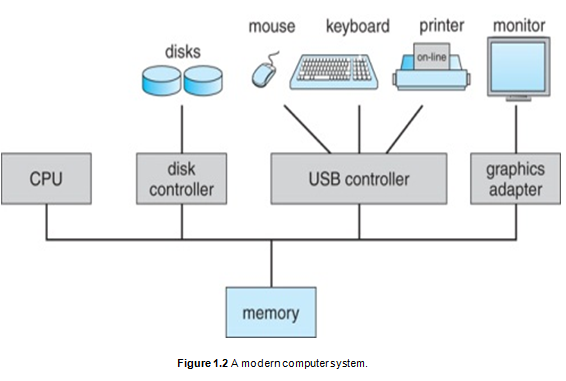

# What is an Operating System?

An operating system (OS) is a program or software that acts as an intermediary between the user, applications, and the computer hardware.

## Operating System Goals

1. **Execute User Programs:** The OS makes it easier to solve user problems by executing their programs. Without an operating system, using a computer (hardware) is very difficult.
2. **Convenience:** The OS makes the computer system (hardware) convenient to use. With an OS, hardware becomes user-friendly, allowing us to run applications smoothly.
3. **Efficient Resource Management:** The OS uses computer hardware efficiently, managing resources (hardware) for several applications or processes running at the same time without any issues.

## Computer System Structure

A computer system can be divided into four components:    
     
1. **Hardware:**
    - Provides basic computing resources like CPU, memory, and I/O devices.

2. **Operating System:**
    - Controls and coordinates the use of hardware among various applications and users simultaneously.

3. **Application Programs:**
    - Define how the system resources (hardware) are used to solve user computing problems. Examples include web browsers, database systems, video games, compilers, and word processors.

4. **Users:**
    - People, machines, and other computers. Nowadays, networking enables other machines to connect to a computer and use the services running on it, making those machines users of the system.

## Operating System Functionality

The operating system makes the computer user-friendly and manages hardware. Without an operating system, running programs directly on hardware is not easy. System and application programs utilize the operating system to access hardware; they cannot access hardware directly and must call OS routines and functions.

### Resource Allocation

The OS is a resource allocator for programs:
- Manages all resources.
- Decides between conflicting requests for efficient and fair resource use.

### Control Program

The OS is a control program:
- Controls the execution of programs to prevent errors and improper use of the computer.
- Ensures that programs do not harm or interfere with each other. For example, multiple applications can run simultaneously on a computer, sharing a single CPU, memory, and hard disk. The OS ensures that these programs do not interfere with each other, such as preventing a process from overwriting memory allocated to another process.

### I/O Access

I/O is accessed via the operating system:
- The OS contains low-level code that knows how to access all I/O devices. Application programs we develop and run do not know how to access I/O devices directly.

Example: In C, calling `printf` to print something to the screen is just a function call, but it ultimately triggers an OS routine to perform the actual I/O operation.

## No Universal Definition

There is no universally accepted definition of an operating system. Each vendor's OS implementation varies widely, but a good approximation includes everything a vendor ships with the OS.

## The Kernel

The one program running at all times on the computer is the kernel. Everything else is either a system program (shipped with the operating system) or an application program that can be installed after the kernel.

- **Kernel = OS**

# Computer Startup   
    
When you power on your computer, the kernel (OS) is loaded into memory and is ready to execute. Over this, you can run system or application programs (such as browsers and games), which use the OS to communicate with the hardware.

## Kernel Loading Process

The kernel is loaded into memory when you power on your computer and runs whenever an application requests a hardware service. Here's how the kernel is loaded:

1. **Bootstrap Program:** When you power on a computer, a "bootstrap program" is loaded and executed automatically. This program is stored in ROM or EPROM.
2. **Stored in ROM:** The bootstrap program is installed in ROM when it is manufactured. This small program, also known as firmware, is permanent software stored in ROM.
3. **Initialization:** The bootstrap program initializes all aspects of the system.
4. **Loading the Kernel:** The bootstrap program loads the operating system (kernel) from the hard disk into memory and starts its execution. The kernel then runs and provides the graphical user interface (GUI).
5. **Concurrent Execution:** The CPU can run both your program and the kernel program simultaneously.

# Computer System Organization

A computer system includes one or more CPUs and device controllers connected through a common bus providing access to shared memory. CPUs and devices execute concurrently, competing for memory cycles.    

    

## Device Controllers

For each device in a computer, there is a device controller. A device controller is a chip that controls the device and knows how to communicate with it. The CPU interacts with device controllers but not directly with the devices. For example, if data needs to be written to a disk, the CPU will task the device controller to handle it.

### Capabilities of Device Controllers

- **Processing:** Device controllers are capable of processing and executing some code.
- **Local Buffer:** They have a small amount of memory called the local buffer.

### Concurrent Execution

- **I/O and CPU:** I/O devices and the CPU can execute concurrently. While the CPU is executing instructions from an application, I/O controllers can perform tasks with I/O devices, such as fetching data from a disk.
- **Local Buffer:** Each device controller is responsible for a particular device type and has a local buffer. The CPU can move data between the main memory and the local buffer.

### Data Transfer

- **Retrieving Data:** If you need to retrieve a block of data from a disk, it is first retrieved to the controller's local buffer, then to the main memory, making it available to the requesting application.
- **Sending Data:** If you want to send something to a printer, the data first goes from memory to the controller, then from the controller to the printer.

### Device Controllers vs. Device Drivers

- **Device Controllers:** These are hardware components.
- **Device Drivers:** These are software components that interact with device controllers.

### Interrupts

Device controllers inform the CPU that they have finished their operations by causing an "interrupt." For example, if a disk controller retrieves a block of data from the disk and it is ready in the controller, it will interrupt the CPU, indicating that the data is available. The CPU then runs a special OS routine (driver routine) to transfer the block of data from the controller to the main memory. Interrupts are physical signals to the CPU.

# Common Functions of Interrupts

An interrupt transfers control to the interrupt service routine, generally through the interrupt vector, which contains the addresses of all the service routines.

## What is an Interrupt Vector?

When an interrupt arrives at the CPU, the CPU might be running other programs. The currently running program is suspended (stopped) for a while, and the address of the corresponding service routine (functions) is found in a table called the "interrupt vector table," which is inside ROM (kernel).

- **Interrupt Number:** Each interrupt has a number, which is used as an index in the interrupt vector table to find the routine.
- **Special Routine:** Using this number, the CPU finds and invokes a special routine to handle the interrupt.

Handling an interrupt involves tasks like moving data from disk to memory or moving data from memory to a printer. After handling an interrupt, the suspended application is resumed for execution in the CPU.

## Key Points about Interrupts

- **Saving Address:** Interrupt architecture must save the address of the interrupted instruction.
- **Disabling Incoming Interrupts:** Incoming interrupts are disabled while another interrupt is being processed to prevent a "lost interrupt."
- **Trap:** A "trap" is a software-generated interrupt caused by either an error (e.g., divide by zero) or a user request (e.g., an application request for I/O). Software interrupts function similarly to hardware interrupts.

# Interrupt-Driven OS

In an interrupt-driven OS:      
          

- If there is no interrupt, the CPU is either being used by applications or is idle.

# Interrupt Handling

The operating system preserves the state of the CPU by storing registers and the program counter.

- When an application is running on the CPU and an interrupt arrives, the application is suspended. Since the application is using the registers in the CPU, its state and context (including the registers) are saved to memory.
- The OS calls the corresponding interrupt service routine, which also uses the CPU registers.
- After handling the interrupt, the suspended application's state and context are restored from memory.
- The application resumes execution from where it left off.

Interrupts might slow down the application, but they do not affect its correctness.

Interrupt Timeline:     
        

# I/O Structure

If an application requests an I/O operation, like `printf` in C or `cout` in C++, it will call a system routine in the operating system.

# Direct Memory Access Structure (DMA)    
        

- **Purpose:** DMA is used for high-speed I/O devices that can transmit information at speeds close to memory speeds.
- **Function:** The device controller transfers blocks of data from buffer storage directly to main memory without CPU intervention.

# How a Modern Computer Works
   
1. **Program Execution:**
   - When a program is moved from the hard disk to memory, the CPU requests an I/O operation to the operating system if needed.
   - The OS calls the appropriate routine to handle the I/O request.
   - Once the data is ready, the device causes an interrupt to the CPU to move data from the device controller (local buffer) to memory.

# Storage Structure

1. **Main Memory:**
   - Main memory (RAM) is the only large storage medium that the CPU can access directly.

2. **Secondary Storage:**
   - Secondary storage extends main memory by providing large, non-volatile storage capacity.
   - It is used for storing data long-term, even when the computer is turned off.

3. **Magnetic Disk:**
   - Magnetic disks are rigid metal or glass platters covered with magnetic recording material.
   - The disk surface is logically divided into tracks, which are further subdivided into sectors.

# Storage Hierarchy

Storage systems are organized in a hierarchy based on several factors:
    
1. **Speed:**
   - Storage systems vary in speed, with faster storage typically being more expensive.

2. **Cost:**
   - Faster storage systems are usually more costly, while larger, slower storage systems are more affordable.

3. **Volatility:**
   - Volatile storage (like RAM) loses data when power is off, while non-volatile storage (like hard drives) retains data without power.

4. **Caching:**
   - **Purpose:** Caching involves copying information into a faster storage system to improve access speed.
   - **Example:** Main memory (RAM) can be viewed as a last cache for secondary storage. It holds data temporarily to speed up access compared to retrieving data from slower, secondary storage.

This hierarchy helps balance speed, cost, and storage capacity efficiently.

# Caching

Caching is an important principle performed at many levels in computers, including hardware, operating systems, and software.

- **Information in use is copied from slower to faster storage temporarily.**
- **Faster storage (cache) is checked first to determine if information is there:**
  - If it is, the information is used directly from the cache (fast).
  - If not, the data is copied to the cache and used there.

The cache is smaller than the storage being cached:
- Cache management is an important design problem.
- Cache size and replacement policy are critical factors.

# Computer System Architecture

Most systems use a single general-purpose processor (PDA's through mainframes), but special-purpose processors are also common.

## Multiprocessor Systems

Multiprocessor systems, also known as parallel systems or tightly-coupled systems, are growing in use and importance. They have several advantages:

- **Increased throughput:** More work done per unit time, allowing one application to run on one CPU and another on a different CPU.
- **Economy of scale:** Cheaper than using multiple computers.
- **Increased reliability:** If an application fails on one CPU, it can shift to another CPU.

Multiprocessors share a single RAM and single hard disk.

### Types of Multiprocessing

- **Asymmetric Multiprocessing:** One processor acts as the master, controlling the slave processors.
- **Symmetric Multiprocessing:** All processors have the same role, and the operating system decides which programs loaded into memory run on which CPU.

### Symmetric Multiprocessing Architecture
      
- Multiple CPUs in the same computer with the same capability.
- The operating system decides which programs loaded into memory will run on which CPU.
- CPUs share the same memory.

### Dual Core Design
      
- A single physical chip (CPU) contains multiple CPUs (cores).
- Multiple cores mean multiple CPUs.

# Operating System Structure
     
One of the most important aspects of an operating system is the ability to multiprogram. 

- A single program cannot, in general, keep either the CPU or the I/O devices busy at all times.
- Single users frequently have multiple programs running.

## Multiprogramming

Multiprogramming increases CPU utilization by organizing jobs (code and data) so the CPU always has one to execute.

- The operating system keeps several jobs in memory simultaneously. Since main memory is too small to accommodate all jobs, they are initially kept on the disk in the job pool.
- The job pool consists of all processes residing on disk awaiting allocation of main memory.
- The set of jobs in memory can be a subset of the jobs kept in the job pool.
- The operating system picks and begins to execute one of the jobs in memory. If the job has to wait for a task, such as an I/O operation, the CPU switches to another job.
- In a non-multiprogrammed system, the CPU would sit idle. In a multiprogrammed system, the CPU is never idle as long as at least one job needs to execute.
- Multiprogrammed systems effectively utilize system resources (CPU, memory, peripheral devices), but they do not provide for user interaction with the computer system.

## Time Sharing (or Multitasking)

Time sharing is a logical extension of multiprogramming.

- In time-sharing systems, the CPU executes multiple jobs by switching among them so frequently that users can interact with each program while it is running.
- Time sharing requires an interactive computer system, which provides direct communication between the user and the system.
- The user gives instructions to the operating system or a program directly using an input device (keyboard, mouse, touchpad, or touch screen) and waits for immediate results on an output device. Response time should be short, typically less than one second.

A program loaded into memory and executing is called a "process". When a process executes, it typically runs for a short time before it finishes or performs I/O.

Time sharing and multiprogramming require several jobs to be kept simultaneously in memory. If there is not enough room for all of them, the system must choose among them, involving "Job Scheduling".

When an OS selects a job from the job pool, it loads that job into memory for execution. Having several programs in memory requires some form of memory management. Additionally, if several jobs are ready to run at the same time, the system must choose which job will run first, involving "CPU Scheduling".

## Operating-System Operations

Modern operating systems are interrupt-driven. Since the operating system and the users share the hardware and software resources of the computer system, we need to ensure that an error in a user program only affects that particular program.

For example:
- If a process gets stuck in an infinite loop, this loop could prevent the correct operation of many other processes.
- More subtle errors can occur in a multiprogramming system, where one erroneous program might modify another program, the data of another program, or even the operating system itself.

# Dual-Mode and Multimode Operation
      
To ensure the proper execution of the operating system, we must distinguish between the execution of operating-system code and user-defined code.

We need to separate modes of operation:
- **User mode** 
- **Kernel mode** (also called supervisor mode, system mode, or privileged mode)

A bit, called the "mode bit," is added to the hardware of the computer to indicate the current mode: kernel (0) or user (1). With the mode bit, we can distinguish between a task executed on behalf of the operating system and one executed on behalf of the user.

- When the computer system is executing on behalf of a user application, the system is in user mode.
- When a user application requests a service from the operating system (via a system call), the system transitions from user to kernel mode to fulfill the request.

At system boot time, the hardware starts in kernel mode. The OS is then loaded and starts user applications in user mode. Whenever a trap or interrupt occurs, the hardware switches from user mode to kernel mode (i.e., changes the state of the mode bit to 0).

Whenever the operating system gains control of the computer, it is in kernel mode. The system always switches to user mode (by setting the mode bit to 1) before passing control to a user program. The dual mode of operation provides us with the means for protecting the operating system from errant users and errant users from one another.

We accomplish this protection by designating some machine instructions that may cause harm as "privileged instructions." The hardware allows privileged instructions to be executed only in kernel mode. If an attempt is made to execute a privileged instruction in user mode, the hardware does not execute the instruction but treats it as illegal and traps it to the operating system.

# Timer

We must ensure that the operating system maintains control over the CPU. We cannot allow a user program to get stuck in an infinite loop or to fail to call system services and never return control to the operating system.

To accomplish this goal, we can use a timer:
- A timer can be set to interrupt the computer after a specified period. The period may be fixed or variable.
- A "variable timer" is generally implemented by a fixed-rate clock and counter.
- The operating system sets the counter. Every time the clock ticks, the counter is decremented. When the counter reaches 0, an interrupt occurs.

We can use the timer to prevent a user program from running too long. A simple technique is to initialize a counter with the amount of time that a program is allowed to run. 

For example:
- A program with a 7-minute time limit would have its counter initialized to 420. Every second the timer interrupts, and the counter is decremented by 1.
- As long as the counter is positive, control is returned to the user program. When the counter becomes zero, the operating system terminates the program for exceeding the assigned time limit.
